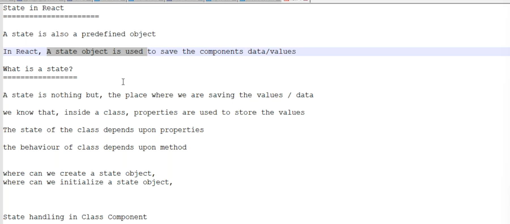
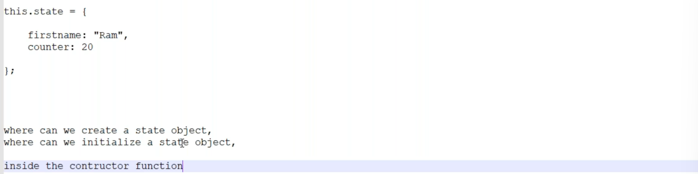
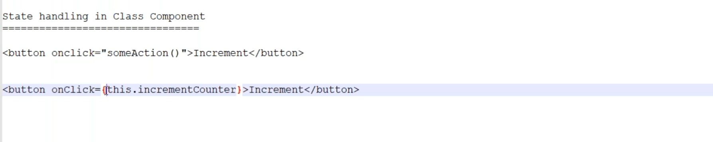
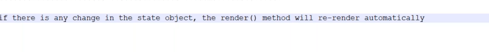
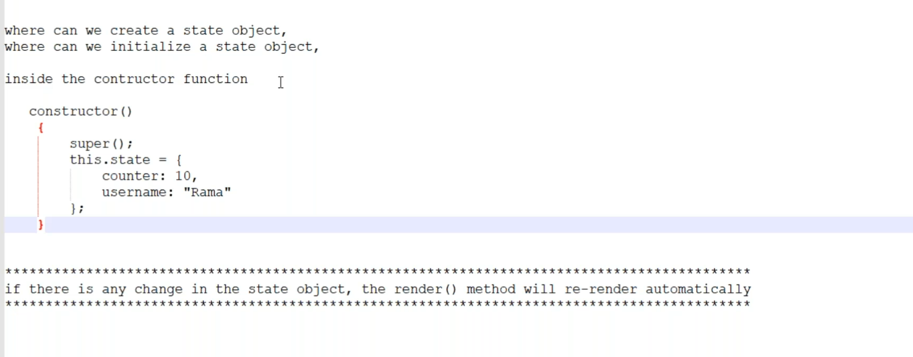
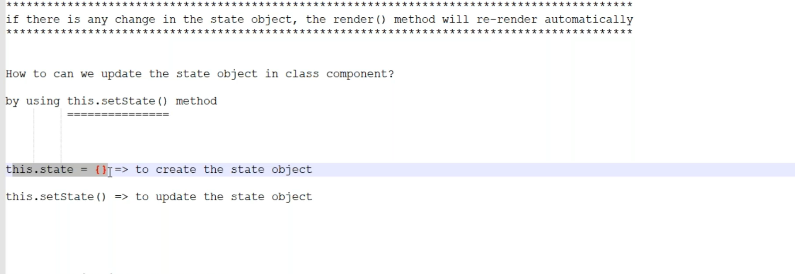

# State in React



```jsx
import { Component } from "react";

class StateDemo extends Component
{

    counter = 10;
    
    incrementCounter = () => {
        this.counter = this.counter + 1;
        console.log(this.counter)
    }


    render()
    {
        return <div>
            <h1>State Demo</h1>
            <h3>Counter - {this.counter}</h3>
            <button onClick={this.incrementCounter}>Increment</button>
        </div>
    }
}
export default StateDemo
```


## Importance of Constructor


```jsx
import { Component } from "react";

class Counter extends Component
{

    constructor() {
        super();
        this.state = {
            counter: 10,
            username: 'Akhil'
        }
    }

    incrementcounter = () =>{
        //  this.state.counter = this.state.counter + 1;
        this.setState({
            counter: this.state.counter +1
        })
    }

    nameUpdate = () =>{
        this.setState({
            username: 'Sai'
        })
    }
    
    render()
    {
        console.log('Calling...')
        return <div>
            <h1>Welcome {this.state.username}</h1>
            <h2>counter - {this.state.counter}</h2>
            <button onClick={this.incrementcounter}>Increment</button>
            <button onClick={this.nameUpdate}>update Name</button>
        </div>
    }
}
export default Counter

```
# ChatGPT
Here are clean and structured **React Class Component Notes on State, Constructor, and setState()** based on your content:

---

## 🔵 **React State (Class Component)**

### 🔹 What is State?

* **State** is a built-in object in React used to store **component-specific data/values**.
* It allows components to create and manage dynamic data.
* When **state changes**, the component **re-renders automatically**.

---

### 🔹 Where is State Created?

* In **class components**, state is created **inside the constructor** using:

```js
this.state = {
  key: value
}
```

---

### 🔹 How is State Initialized?

* You initialize state inside the **constructor function** using `this.state = {}`.

---

## 🔵 **Constructor in Class Component**

### 🔹 What is Constructor?

* The constructor is a **special method** used for:

  * Initializing the component
  * Setting the initial state
  * Binding methods (if needed)

### 🔹 Syntax:

```js
constructor() {
  super(); // must call super() before using 'this'
  this.state = {
    counter: 10,
    username: "Rama"
  };
}
```

---

## 🔵 **Updating State in Class Components**

### 🔹 Can we update state directly?

❌ No, you should **never modify `this.state` directly** like:

```js
this.state.counter = this.state.counter + 1; // ❌ Wrong
```

### ✅ Use `this.setState()` method:

```js
this.setState({
  counter: this.state.counter + 1
});
```

### 🔹 setState() does 2 things:

1. Updates the state
2. Triggers **automatic re-rendering**

---

## 🔵 **Class Component Example with State and setState()**

```jsx
import { Component } from "react";

class Counter extends Component {
  
  constructor() {
    super();
    this.state = {
      counter: 10,
      username: 'Akhil'
    };
  }

  incrementCounter = () => {
    this.setState({
      counter: this.state.counter + 1
    });
  }

  nameUpdate = () => {
    this.setState({
      username: 'Sai'
    });
  }

  render() {
    console.log('Rendering...');
    return (
      <div>
        <h1>Welcome {this.state.username}</h1>
        <h2>Counter - {this.state.counter}</h2>
        <button onClick={this.incrementCounter}>Increment</button>
        <button onClick={this.nameUpdate}>Update Name</button>
      </div>
    );
  }
}

export default Counter;
```

---

## 🔵 Summary

| Concept           | Description                                   |
| ----------------- | --------------------------------------------- |
| `state`           | Object that stores dynamic values             |
| `constructor()`   | Initializes the component and sets up state   |
| `super()`         | Calls the parent `Component` class            |
| `this.state`      | Used to define the initial state              |
| `this.setState()` | Used to update state and trigger re-rendering |
| Re-rendering      | Happens automatically when state changes      |

---

