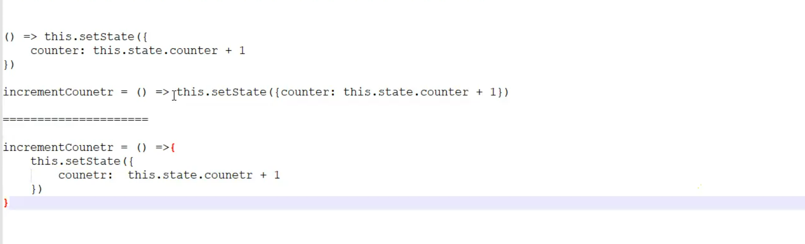

```jsx
import { Component } from "react";

class CounterOne extends Component
{

    constructor(){
        super();
        this.state = {
            counter:  0,
            username: 'Akhil'
        }
    }

    incrementcounter=()=>{
        this.setState({
            counter: this.state.counter +1
        })
    }

    decrementcounter =() =>{
        this.setState({
            counter: this.state.counter -1
        })
    }

    resetcounter = () =>{
        this.setState({
            counter: 0
        })
    }

    render ()
    {
        return <div>
            <h1>Counter One Class Component</h1>
            <h3>Counter: {this.state.counter}</h3>
            <button onClick={this.incrementcounter}>Increment</button>
            <button onClick={this.decrementcounter}>Decrement</button>
            <button onClick={this.resetcounter}>Reset</button>

        </div>
    }
}
export default CounterOne
```
```jsx
import { Component } from "react";

class CounterOne extends Component
{

    constructor(){
        super();
        this.state = {
            counter:  0,
            username: 'Akhil'
        }
    }

    incrementcounter=()=>{
        this.setState({
            counter: this.state.counter +1
        })
    }

    decrementcounter =() =>{
        this.setState({
            counter: this.state.counter -1
        })
    }

    resetcounter = () =>{
        this.setState({
            counter: 0
        })
    }

    render ()
    {
        return <div>
            <h1>Counter One Class Component</h1>
            <h3>Counter: {this.state.counter} { this.state.counter % 2 === 0 ? 'Even' : 'Odd'}</h3>
            <button onClick={this.incrementcounter} >Increment</button>
            <button onClick={this.decrementcounter}>Decrement</button>
            <button onClick={this.resetcounter}>Reset</button>

        </div>
    }
}
export default CounterOne
```
## inline function of setState
```jsx
import { Component } from "react";

class CounterTwo extends Component
{

    constructor(){
        super();
        this.state = {
            counter:  0,
            username: 'Akhil'
        }
    }


    decrementcounter =() =>{
        this.setState({
            counter: this.state.counter -1
        })
    }

    resetcounter = () =>{
        this.setState({
            counter: 0
        })
    }

    render ()
    {
        return <div>
            <h1>Counter Two Class Component</h1>
            <h3>Counter: {this.state.counter} - { this.state.counter % 2 === 0 ? 'Even' : 'Odd'}</h3>
            <button onClick={() => this.setState({ counter: this.state.counter +1})} >Increment</button>
            <button onClick={this.decrementcounter}>Decrement</button>
            <button onClick={this.resetcounter}>Reset</button>
        </div>
    }
}
export default CounterTwo
```

```jsx
import { Component } from "react";

class CounterTwo extends Component
{

    constructor(){
        super();
        this.state = {
            counter:  0,
            username: 'Akhil'
        }
    }


    // decrementcounter =() =>{
    //     this.setState({
    //         counter: this.state.counter -1
    //     })
    // }

    // resetcounter = () =>{
    //     this.setState({
    //         counter: 0
    //     })
    // }

    render ()
    {
        return <div>
            <h1>Counter Two Class Component</h1>
            <h3>Counter: {this.state.counter} - { this.state.counter % 2 === 0 ? 'Even' : 'Odd'}</h3>
            <button onClick={() => this.setState({ counter: this.state.counter +1})} >Increment</button>
            <button onClick={() => this.setState({ counter: this.state.counter -1})}>Decrement</button>
            <button onClick={() => this.setState({ counter: 0})}>Reset</button>
        </div>
    }
}
export default CounterTwo
```
```jsx
        render ()
    {
        return <div>
            <h1>Counter Two Class Component</h1>
            <h2>Welcome {this.state.username} </h2>
            <h3>Counter: {this.state.counter} - { this.state.counter % 2 === 0 ? 'Even' : 'Odd'}</h3>
            <button onClick={() => this.setState({ counter: this.state.counter +1})} >Increment</button>
            <button onClick={() => this.setState({ counter: this.state.counter -1})}>Decrement</button>
            <button onClick={() => this.setState({ counter: 0, username: 'Akhil'})}>Reset</button>
            <button onMouseOver={() => this.setState({username: 'Konduri Akhil'})}>Update Name</button>
        </div>
    }
```
## loopcase stateupdation ?

```jsx
import { Component } from "react";

class ClassThree extends Component
{

    constructor(){
        super();
        this.state = {
            counter: 0,
            username: 'Akhil',
            city: 'Hyderabad'
        }
    }

    increasecountby5 = () =>{
        for(var i=0; i<5; i++){
            this.setState((preState) =>({
                counter: preState.counter + 1
            }))
        }
    }

    
 

    render(){
        return <div>
            <h1>Increase Count (By 5)-{this.state.counter}</h1>
            <button onClick={this.increasecountby5}>Increase by 5</button>


        </div>
    }
}

export default ClassThree
```
# ChatGPT
---

## 🧠 **React Class Components - Notes & Concepts**

---

### ✅ **1. Class Component Syntax**

```jsx
import { Component } from "react";

class ComponentName extends Component {
  // constructor
  // state
  // methods
  // render()
}
```

* `Component` is imported from React.
* Class components must extend `Component`.
* Must include a `render()` method which returns JSX.

---

### ✅ **2. Constructor and State Initialization**

```jsx
constructor() {
  super();
  this.state = {
    counter: 0,
    username: 'Akhil'
  };
}
```

* The `constructor` is used to initialize state.
* `super()` must be called before using `this`.
* `this.state` is an object used to hold component's local data.

---

### ✅ **3. Updating State Using `setState`**

**Normal Syntax:**

```jsx
this.setState({
  counter: this.state.counter + 1
});
```

**Functional (Recommended in Loops or Based on Previous State):**

```jsx
this.setState((prevState) => ({
  counter: prevState.counter + 1
}));
```

---

### ✅ **4. Inline State Updates**

```jsx
<button onClick={() => this.setState({ counter: this.state.counter + 1 })}>Increment</button>
```

* Event handler directly uses arrow function and inline `setState`.
* Useful for short, simple actions without defining a separate function.

---

### ✅ **5. Conditional Rendering Inside JSX**

```jsx
<h3>
  Counter: {this.state.counter} - {this.state.counter % 2 === 0 ? "Even" : "Odd"}
</h3>
```

* Ternary operator used to check if the counter is even or odd.
* This logic can be placed directly inside JSX.

---

### ✅ **6. Resetting Multiple State Values**

```jsx
this.setState({ counter: 0, username: 'Akhil' });
```

* `setState` can update multiple state properties at once.

---

### ✅ **7. Using Mouse Events (onMouseOver)**

```jsx
<button onMouseOver={() => this.setState({ username: "Konduri Akhil" })}>
  Update Name
</button>
```

* Event handlers like `onMouseOver` trigger when the user hovers over an element.

---

### ✅ **8. State Update in a Loop**

```jsx
for (var i = 0; i < 5; i++) {
  this.setState((prevState) => ({
    counter: prevState.counter + 1
  }));
}
```

* **Important**: `setState` is asynchronous.
* So using previous state inside a loop **requires** functional `setState`.
* Otherwise, multiple updates may not reflect correctly due to batching.

---

### ❗ Best Practices and Warnings

* ❌ Avoid writing `this.setState({ counter: this.state.counter + 1 })` inside a loop. It may cause unexpected results.
* ✅ Always use **functional `setState`** (`(prevState) => {}`) when new state depends on the **previous state**.

---

## ✅ Summary of Components Created

| Component Name | Description                                                            |
| -------------- | ---------------------------------------------------------------------- |
| `CounterOne`   | Class component with named methods for increment, decrement, and reset |
| `CounterTwo`   | Class component using **inline arrow functions** for `setState`        |
| `ClassThree`   | Demonstrates state update inside a loop using functional `setState`    |

---
