# Life Cycle Methods of Class Components
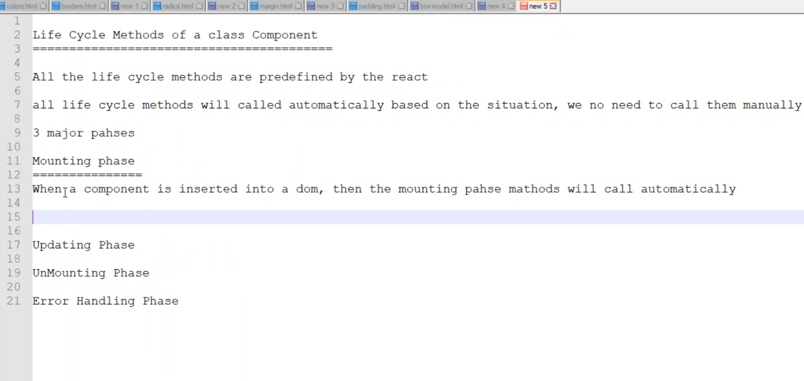
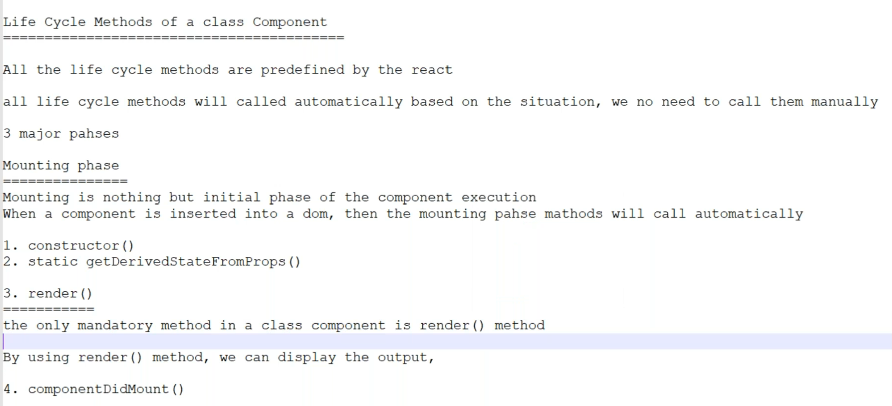
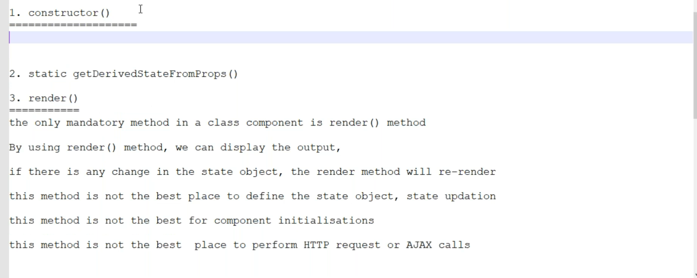
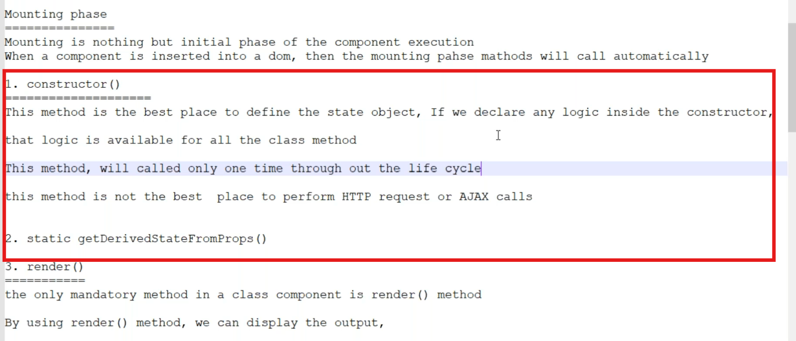
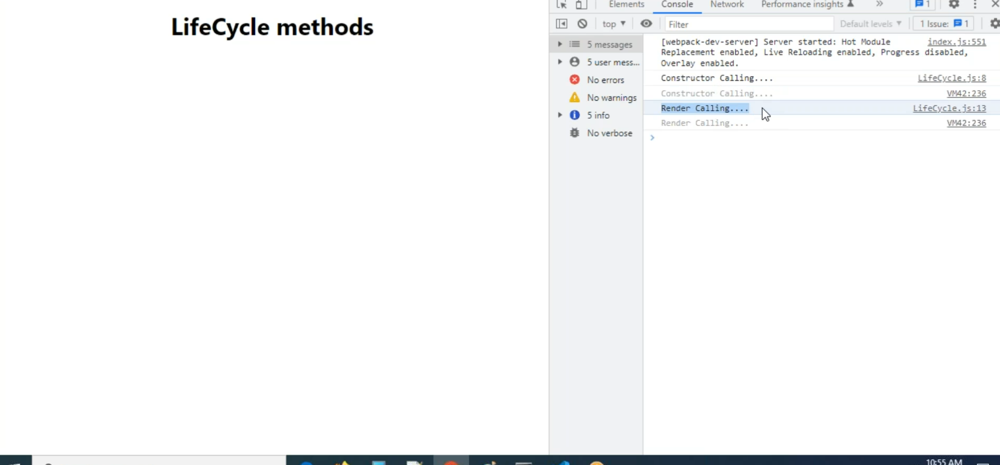
### only render is calling automatically when there is changing in state
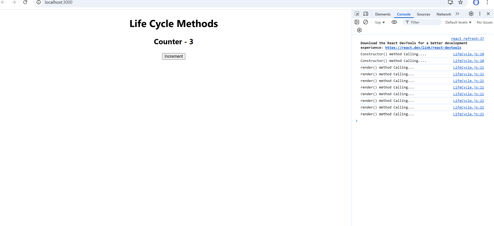
## static getDerivedStateFromProps()
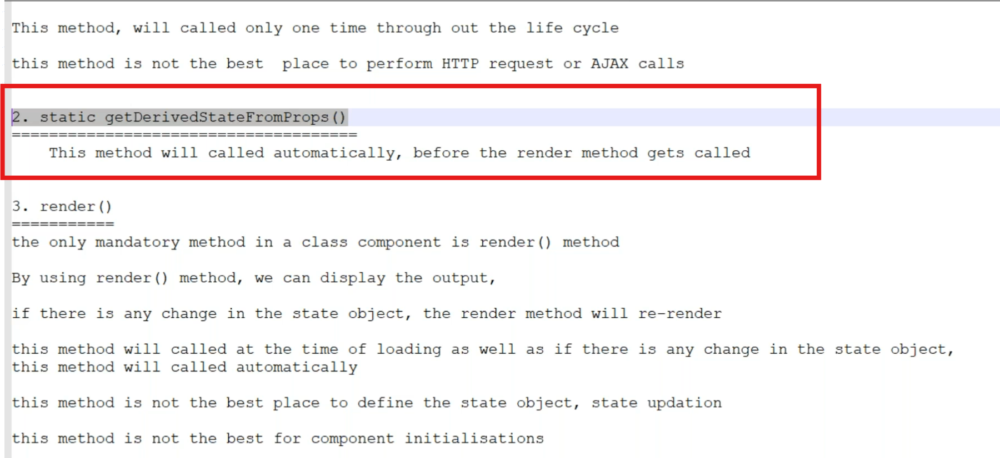
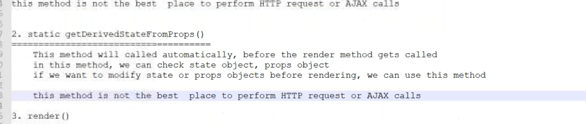
```jsx
import { Component } from "react";

class LifeCycle extends Component
{    
    constructor(){
        super();
        this.state = {
            counter: 0,
        }
        console.log('Calling Constructor()....')
    }

    increment = () => {
        this.setState({
            counter: this.state.counter + 1
        })
    }

    static getDerivedStateFromProps(){
        console.log('Calling getDerivedStateFromProps()....')
        return null;
    }


    render(){
        console.log('Calling render()...')
        return <div>
            <h1>Life Cycle Methods</h1>
            <h2>Counter - {this.state.counter}</h2>
            <button onClick={this.increment}>Increment</button>
        </div>
    }
}
export default LifeCycle
```
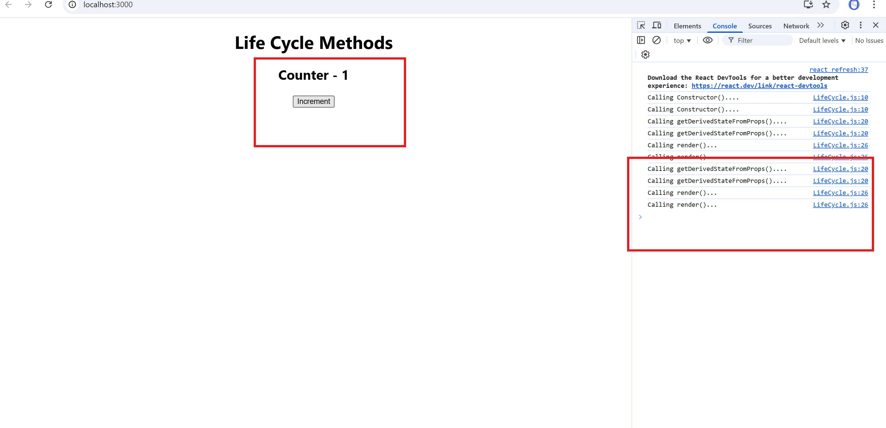

## componentDidMount()
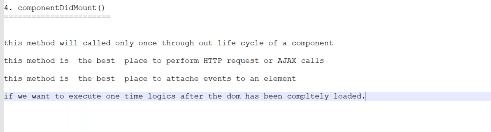
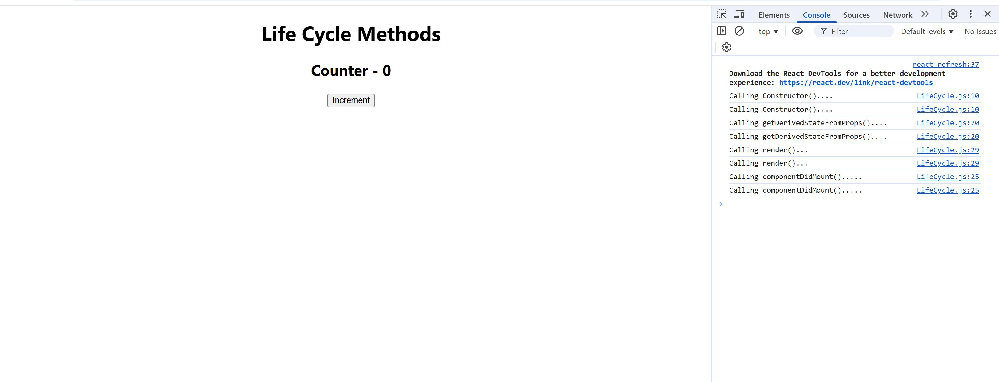
```jsx
import { Component } from "react";

class LifeCycle extends Component
{    
    constructor(){
        super();
        this.state = {
            counter: 0,
        }
        console.log('Calling Constructor()....')
    }

    increment = () => {
        this.setState({
            counter: this.state.counter + 1
        })
    }

    static getDerivedStateFromProps(){
        console.log('Calling getDerivedStateFromProps()....')
        return null;
    }

    componentDidMount(){
        console.log('Calling componentDidMount().....')
    }

    render(){
        console.log('Calling render()...')
        return <div>
            <h1>Life Cycle Methods</h1>
            <h2>Counter - {this.state.counter}</h2>
            <button onClick={this.increment}>Increment</button>
        </div>
    }
}
export default LifeCycle
```
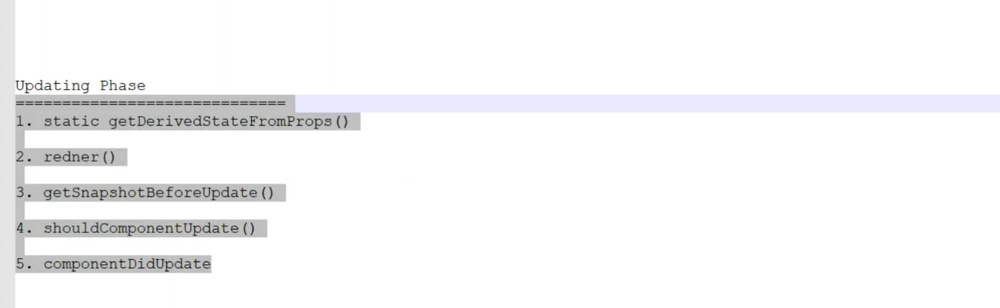
# ChatGPT
---

## 🔁 React Class Component Life Cycle Methods

### ✅ Overview

* Life Cycle Methods are **predefined methods** in React.
* They are **automatically called** at specific stages of a component’s life.
* We **do not manually invoke** them.
* Life Cycle is divided into **4 phases**:

  1. Mounting
  2. Updating
  3. Unmounting
  4. Error Handling

---

## 🔷 1. Mounting Phase

> When a component is **inserted into the DOM**.

### 📌 Methods in Order:

1. **constructor()**
2. **static getDerivedStateFromProps()**
3. **render()**
4. **componentDidMount()**

---

### 🔹 `constructor()`

* First method called during the mounting phase.
* Best place to:

  * **Initialize state**
  * **Bind methods**
* Called **only once** in the component's life.
* ❌ Not recommended for:

  * API calls
  * DOM operations

```js
constructor() {
  super();
  this.state = { counter: 0 };
  console.log('Calling Constructor()...');
}
```

---

### 🔹 `static getDerivedStateFromProps(props, state)`

* Called **before every render** (initial and updates).
* Used to **sync props with state**.
* Returns an object to **update state**, or `null` to do nothing.
* ❌ Not for API calls or side effects.

```js
static getDerivedStateFromProps(props, state) {
  console.log('Calling getDerivedStateFromProps()...');
  return null;
}
```

---

### 🔹 `render()`

* The **only required method** in a class component.

* Responsible for **returning JSX UI**.

* Called:

  * Initially when component loads.
  * On **state/props update**.

* ❌ Not for:

  * State updates
  * Side effects
  * API calls

```js
render() {
  console.log('Calling render()...');
  return (
    <div>
      <h1>Life Cycle Methods</h1>
      <h2>Counter - {this.state.counter}</h2>
      <button onClick={this.increment}>Increment</button>
    </div>
  );
}
```

---

### 🔹 `componentDidMount()`

* Called **once after initial render**.
* Best place to:

  * **Make API calls**
  * **Attach event listeners**
  * **Trigger side effects**

```js
componentDidMount() {
  console.log('Calling componentDidMount()...');
}
```

---

## 🔷 2. Updating Phase

> Triggered when **state or props change**.

### 📌 Methods in Order:

1. **static getDerivedStateFromProps()**
2. **shouldComponentUpdate()**
3. **render()**
4. **getSnapshotBeforeUpdate()**
5. **componentDidUpdate()**

---

### 🔹 `shouldComponentUpdate(nextProps, nextState)`

* Used to **optimize performance**.
* Returns `true` or `false` to allow/prevent re-render.
* Default is `true`.

---

### 🔹 `getSnapshotBeforeUpdate(prevProps, prevState)`

* Called **just before DOM is updated**.
* Used to capture DOM info (e.g., scroll position).
* Value returned here is passed to `componentDidUpdate()`.

---

### 🔹 `componentDidUpdate(prevProps, prevState, snapshot)`

* Called **after component updates** (state or props).
* Best place for:

  * **Side effects** on update
  * **Re-fetching data** based on prop changes

---

## 🔷 3. Unmounting Phase

> When component is **removed from the DOM**.

### 📌 Method:

* **componentWillUnmount()**

  * Clean up tasks like:

    * Clearing timers
    * Removing event listeners
    * Cancelling API calls

---

## 🔷 4. Error Handling Phase

> Handles JavaScript errors in rendering or life cycle methods.

### 📌 Methods:

* **static getDerivedStateFromError(error)**
* **componentDidCatch(error, info)**

Used to:

* Display fallback UI
* Log error details

---

## 🧪 Example Code (Mounting Phase)

```jsx
import { Component } from "react";

class LifeCycle extends Component {
  constructor() {
    super();
    this.state = { counter: 0 };
    console.log("Calling Constructor()...");
  }

  increment = () => {
    this.setState({ counter: this.state.counter + 1 });
  };

  static getDerivedStateFromProps() {
    console.log("Calling getDerivedStateFromProps()...");
    return null;
  }

  componentDidMount() {
    console.log("Calling componentDidMount()...");
  }

  render() {
    console.log("Calling render()...");
    return (
      <div>
        <h1>Life Cycle Methods</h1>
        <h2>Counter - {this.state.counter}</h2>
        <button onClick={this.increment}>Increment</button>
      </div>
    );
  }
}

export default LifeCycle;
```

---

## ✅ Quick Summary Table

| Phase          | Method                            | Purpose                                 |
| -------------- | --------------------------------- | --------------------------------------- |
| Mounting       | constructor()                     | Initialize state and bind methods       |
|                | static getDerivedStateFromProps() | Sync props to state                     |
|                | render()                          | Return JSX UI                           |
|                | componentDidMount()               | Perform side effects after DOM render   |
| Updating       | static getDerivedStateFromProps() | Sync props to state before every render |
|                | shouldComponentUpdate()           | Control whether to re-render or not     |
|                | render()                          | Return updated UI                       |
|                | getSnapshotBeforeUpdate()         | Capture DOM info before update          |
|                | componentDidUpdate()              | Perform side effects after update       |
| Unmounting     | componentWillUnmount()            | Clean up (timers, listeners)            |
| Error Handling | getDerivedStateFromError()        | Update state on error                   |
|                | componentDidCatch()               | Log error details                       |

---


