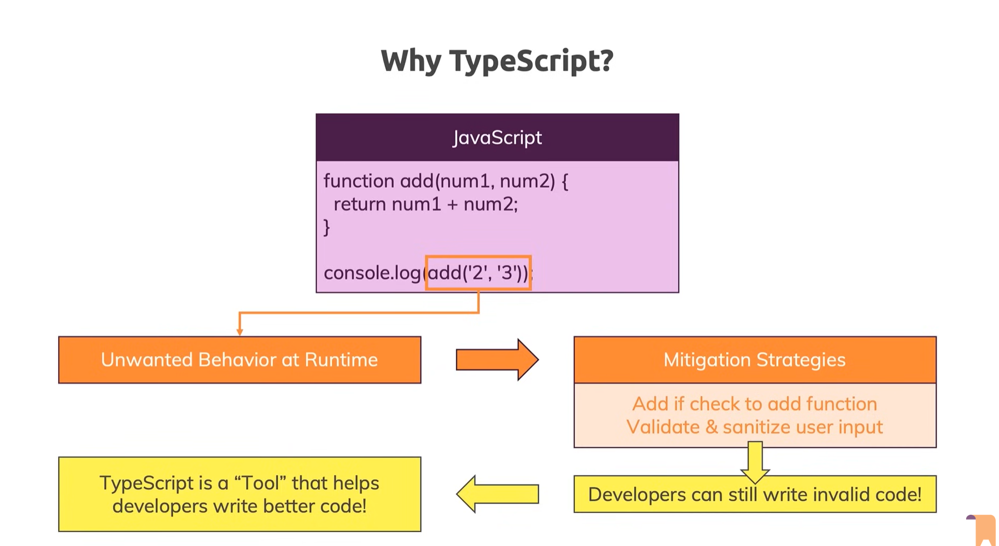

# TypeScript




```html
<!DOCTYPE html>
<html lang="en">
  <head>
    <meta charset="UTF-8" />
    <meta name="viewport" content="width=device-width, initial-scale=1.0" />
    <title>Practice Tab</title>
    <script src="script.js" defer></script>
  </head>

  <body>
    <input type="number" id="num1" placeholder="Number 1" />
    <input type="number" id="num2" placeholder="Number 2" />
    <button>Add!</button>
  </body>
</html>
```

```js
const button = document.querySelector("button");
const input1 = document.getElementById("num1");
const input2 = document.getElementById("num2");

function add(num1, num2) {
  return num1 + num2;
}

button.addEventListener("click", function () {
  console.log(add(input1.value, input2.value));
});
```


- In JS **input.value** is always a **string**.

### For the additon not concatination

```jsx
const button = document.querySelector("button");
const input1 = document.getElementById("num1");
const input2 = document.getElementById("num2");

function add(num1, num2) {
  if (typeof input1 === "number" && typeof input2 === "number") {
    return input1 + input2;
  } else {
    return +num1 + +num2;
  }
}

button.addEventListener("click", function () {
  console.log(add(input1.value, input2.value));
});
```


```sh
npm install -g typescript
tsc -v
```

## Typescript

- The extension for the typescript is **.ts**

### Typecasting

**Typecasting** (in TypeScript and other typed languages) means **telling the compiler to treat a value as a different type than it is currently inferred to be**.

---

### 🔹 In TypeScript

TypeScript uses **type assertions** (not runtime conversions).
It doesn’t change the actual value at runtime — it only helps the compiler understand what type you _intend_ a value to be.

---

### Example 1: Casting `unknown` to `string`

```ts
let someValue: unknown = "Hello TypeScript";

// TypeScript doesn't know its type, so we cast it
let strLength: number = (someValue as string).length;

console.log(strLength); // 16
```

Here we **cast** `someValue` (which is `unknown`) to a `string` so we can use `.length`.

---

### Example 2: Two ways of typecasting

TypeScript supports **two syntaxes**:

```ts
// Using "as" syntax (recommended)
let val1: number = (someValue as string).length;

// Using angle-bracket syntax (works but not in JSX/React)
let val2: number = (<string>someValue).length;
```

---

### Example 3: DOM element casting

```ts
let input = document.getElementById("username");

// Without casting, TypeScript thinks it's HTMLElement
(input as HTMLInputElement).value = "Akhil";
```

Here, we cast `HTMLElement` → `HTMLInputElement` so we can access `.value`.

---

### 🚨 Important

- **Typecasting ≠ Type Conversion**
  Typecasting only **tells the compiler** to treat something differently.
  It doesn’t change the actual value like `Number("123")` or `String(100)` would.

---

## Execute the command that which given

```sh
tsc ./using-ts.ts
```

```tsc
const button = document.querySelector("button");
const input1 = document.getElementById("num1")! as HTMLInputElement;
const input2 = document.getElementById("num2")! as HTMLInputElement;

function add(num1: number, num2: number) {
  return num1 + num2;
}

button.addEventListener("click", function () {
  console.log(add(+input1.value, +input2.value));
});

```

- It creates the **using-ts.js** file
- Typescript compiler converts the .ts file to .js file
