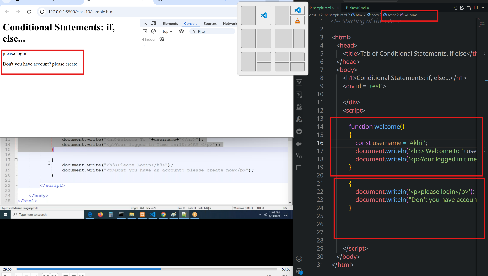
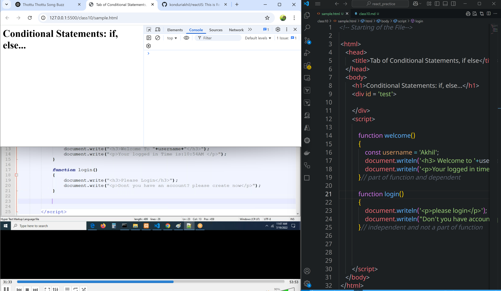
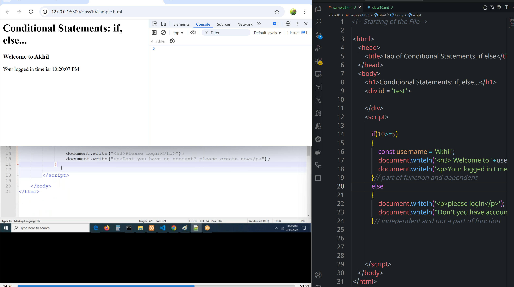
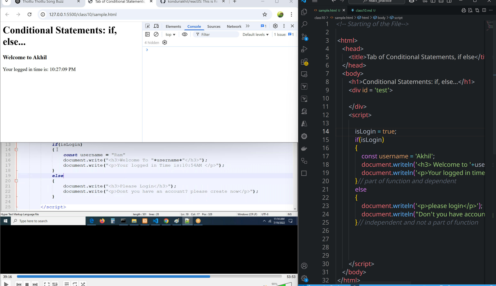
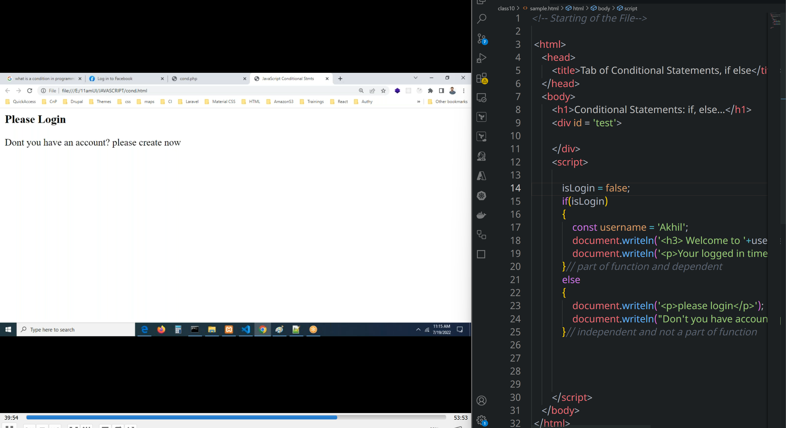

# Conditional Statements
* **if**
* **else**
* **else if**
* **switch**
* **ternary operator**
### What is condition?
*  Some rules and regulations
*  It is a collection of statements defined by developer
*  
### purpose of condition
* if we want to execute some block of code at particular point of time only.
* 
### Block of code
* A block of code is used to group multiple statements
* Block of code is independent
```sh
{
    statement1
    statement2
    statement3
    ....
    statementN
}

{
    var x = 8;
    document.write(x);
    alert();
    .....
    statementN;
}
```
```html
<!-- Starting of the File-->

 <html>
    <head>
        <title>Tab of Conditional Statements, if else</title>
    </head>
    <body>
        <h1>Conditional Statements: if, else...</h1>
        <div id = 'test'>

        </div>
        <script>

            function welcome()
            {
                const username = 'Akhil';
                document.writeln('<h3> Welcome to '+username+'</h3>');
                document.writeln('<p>Your logged in time is: '+new Date().toLocaleTimeString()+'</p>');
            }// part of function and dependent

            {
                document.writeln('<p>please login</p>');
                document.writeln("Don't you have account? please create");
            }// independent and not a part of function

        </script>
    </body>
 </html>
```
## if Statement
* To execute the block of code, the condition should evaluated/calculated to true, that block of code is executed
* Execution one time only
```js
if(condition)
    statement//single statement

or

if(condition)
{
    statements//multiple statements
}
```
```html
<!-- Starting of the File-->

 <html>
    <head>
        <title>Tab of Conditional Statements, if else</title>
    </head>
    <body>
        <h1>Conditional Statements: if, else...</h1>
        <div id = 'test'>

        </div>
        <script>

            isLogin = false;
            if(isLogin)
            {
                const username = 'Akhil';
                document.writeln('<h3> Welcome to '+username+'</h3>');
                document.writeln('<p>Your logged in time is: '+new Date().toLocaleTimeString()+'</p>');
            }// part of function and dependent
            else
            {
                document.writeln('<p>please login</p>');
                document.writeln("Don't you have account? please create");
            }// independent and not a part of function

        </script>
    </body>
 </html>
```





