# Class 11
# Conditional statements if, else
* For following if condition does not 
work
* After evaluating the condition if we got below. the block of code will never executed
      * null
      * false
      * 0
      * undefined
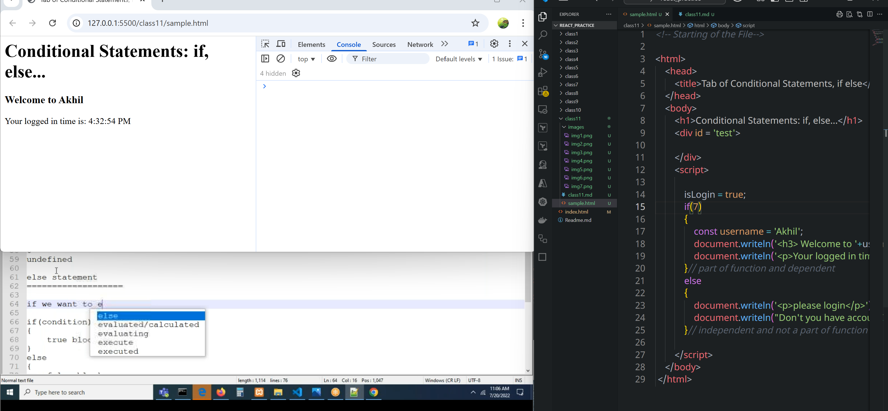
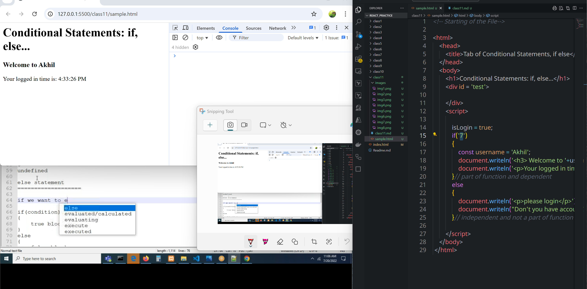
* If we pass anything apart from above, if condition will get executed
* Without **if** statement **else** statement does not exist or it will give **syntax error.**
```html
<!-- Starting of the File-->

<html>
    <head>
        <title>Tab of Conditional Statements, if else</title>
    </head>
    <body>
        <h1>Conditional Statements: if, else...</h1>
        <div id = 'test'>

        </div>
        <script>

            isLogin = true;
            if(4 % 2 === 0)
            {
                const username = 'Akhil';
                document.writeln('<h3> Welcome to '+username+'</h3>');
                document.writeln('<p>Your logged in time is: '+new Date().toLocaleTimeString()+'</p>');
            }// part of function and dependent
            else
            {
                document.writeln('<p>please login</p>');
                document.writeln("Don't you have account? please create");
            }// independent and not a part of function

        </script>
    </body>
 </html>
```
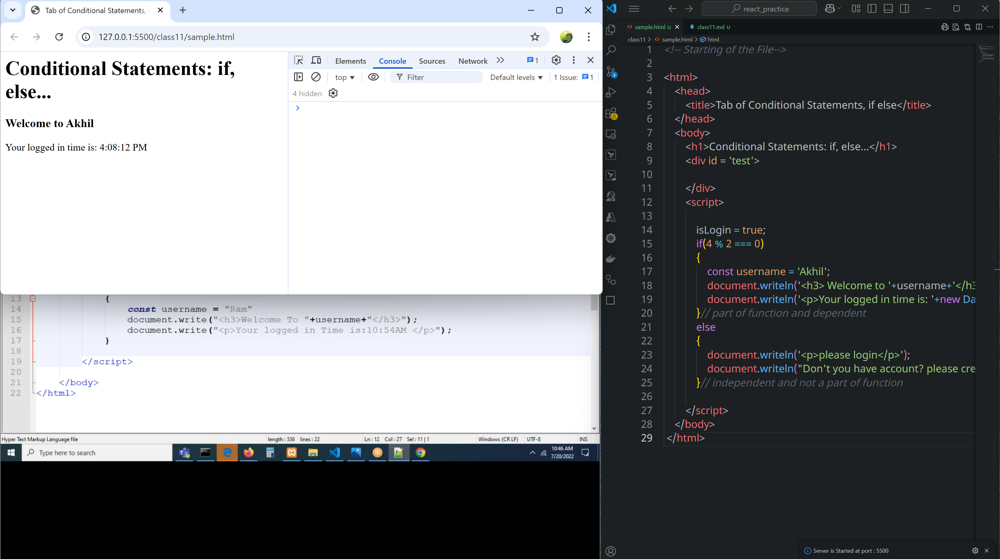
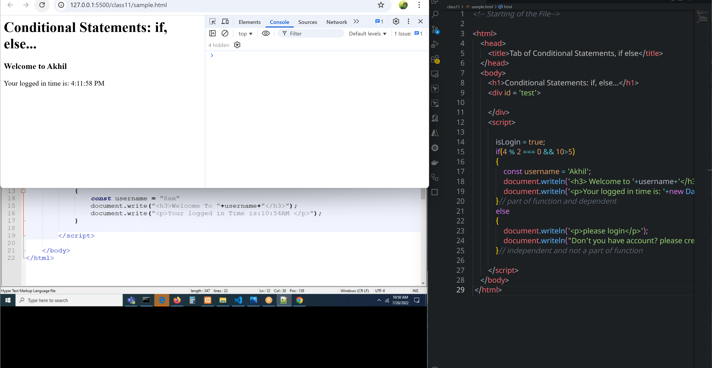
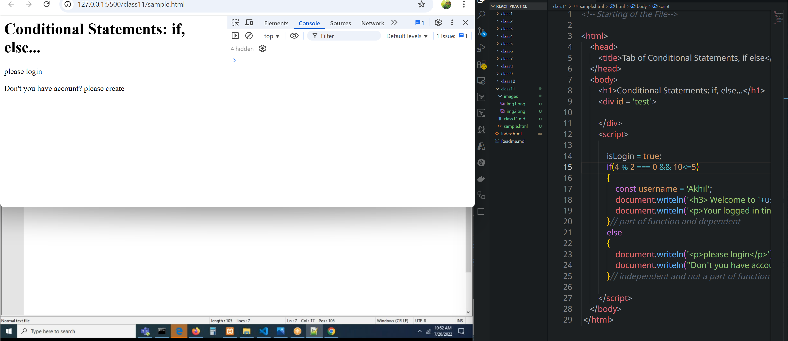
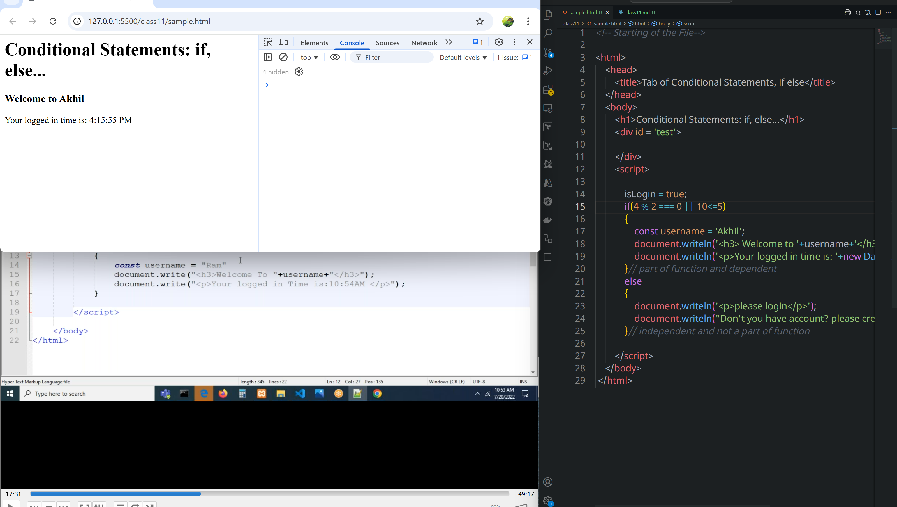
### Everytime evaluation happens through right side to left side
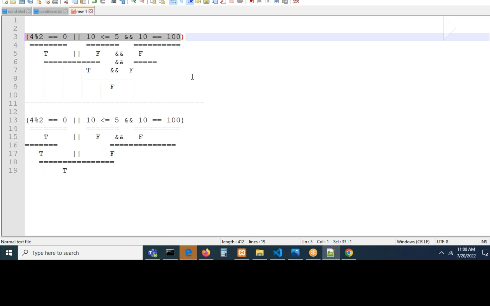
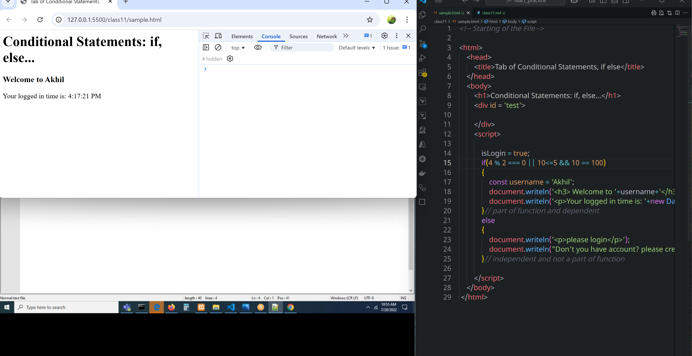
* if we have brackets BODMOS RULE will apply.
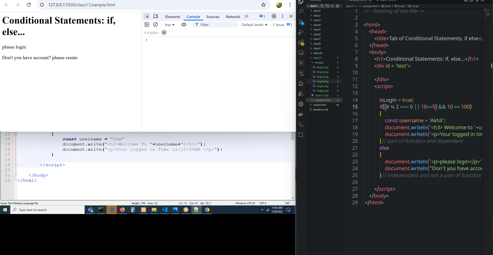
### else if
* To check one of many conditions
* To check multiple conditons on a single value
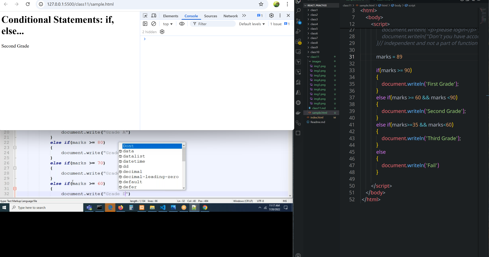
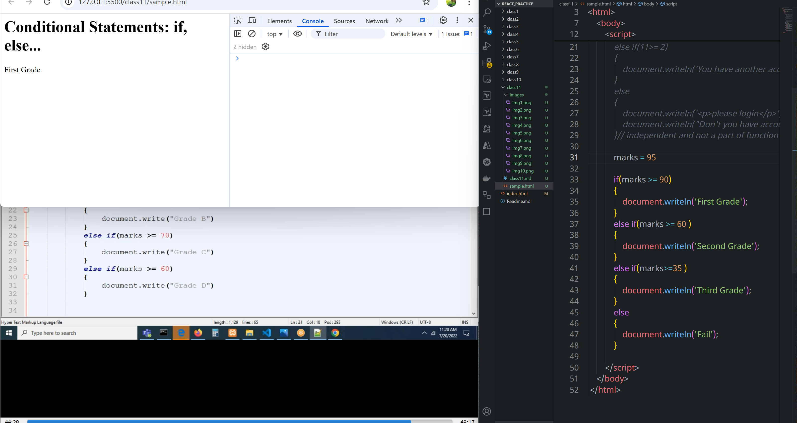
#### In this if one condition is true it prints that value and does not go for next


