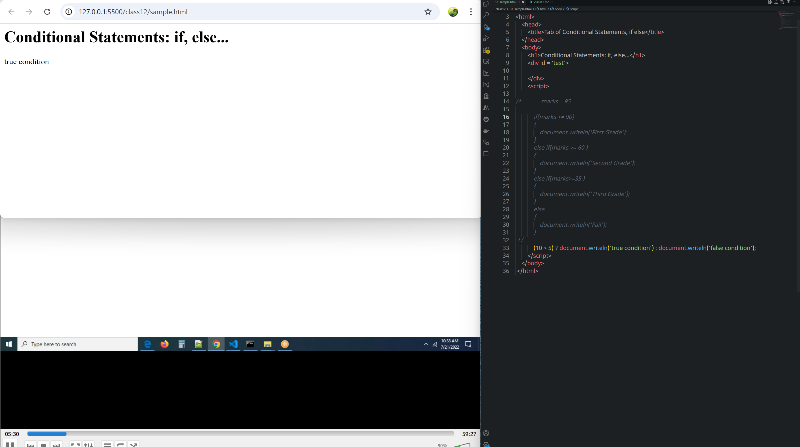
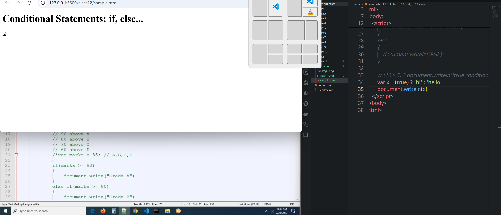
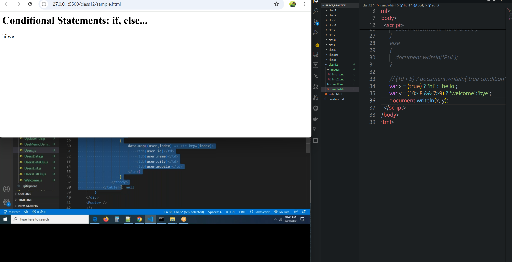
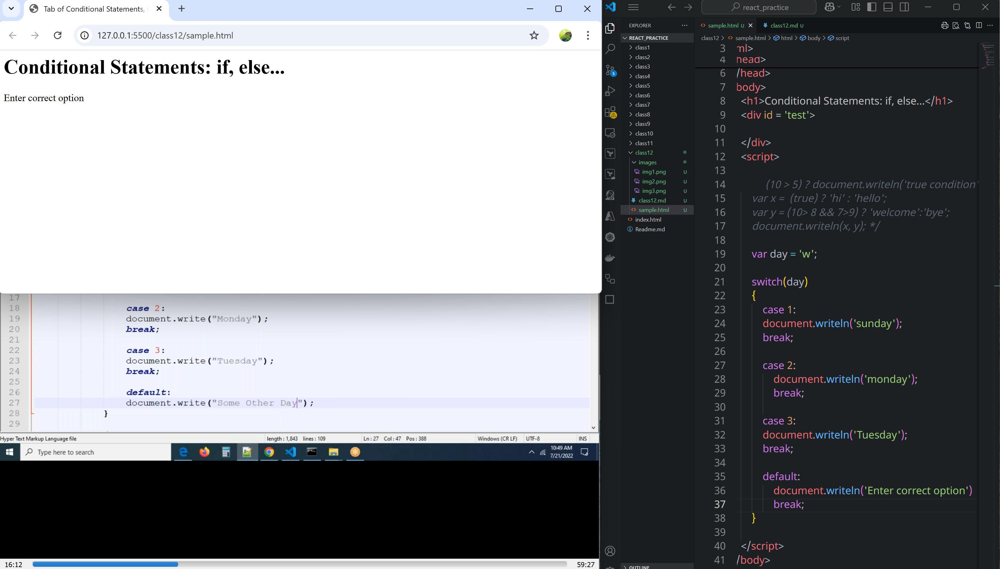
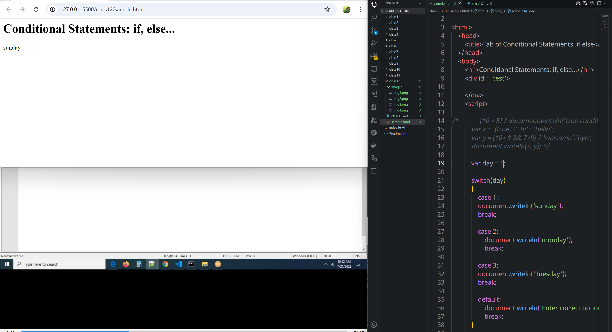

# class 12
# Ternary, Operator, Switch
## syntax
* This can be said as simple if else statement
* In this can able to write only one statement as contraction to if condition has multiple statements in a block.
```js
(condition) ? true block : false block;
```



```html
<!-- Starting of the File-->

<html>
    <head>
        <title>Tab of Conditional Statements, if else</title>
    </head>
    <body>
        <h1>Conditional Statements: if, else...</h1>
        <div id = 'test'>

        </div>
        <script>

/*             marks = 95

            if(marks >= 90)
            {
                document.writeln('First Grade');
            }
            else if(marks >= 60 )
            {
                document.writeln('Second Grade');
            }
            else if(marks>=35 )
            {
                document.writeln('Third Grade');
            }
            else
            {
                document.writeln('Fail');
            }
 */
            (10 > 5) ? document.writeln('true condition') : document.writeln('false condition');
            var x =  (true) ? 'hi' : 'hello';
            var y = (10> 8 && 7>9) ? 'welcome':'bye';
            document.writeln(x, y);
        </script>
    </body>
 </html>
```
# switch
## syntax
* It is also used to check multiple conditons for a single variable.
* for simple conditions we use switch
* for complex conditions we can use if,else conditions
* If you work with complex conditons like comparison it is not usefull
* 
```js
switch (condition) {
    case1:
    //statements
    break;

    case2:
    //statement
    break;
    .........
    ..........
    default:
        //statement

}
```


```html
<!-- Starting of the File-->

<html>
    <head>
        <title>Tab of Conditional Statements, if else</title>
    </head>
    <body>
        <h1>Conditional Statements: if, else...</h1>
        <div id = 'test'>

        </div>
        <script>

/*             (10 > 5) ? document.writeln('true condition') : document.writeln('false condition');
            var x =  (true) ? 'hi' : 'hello';
            var y = (10> 8 && 7>9) ? 'welcome':'bye';
            document.writeln(x, y); */

            var day = 1;

            switch(day)
            {
                case 1 :
                document.writeln('sunday');
                break;

                case 2:
                    document.writeln('monday');
                    break;

                case 3: 
                document.writeln('Tuesday');
                break;

                default:
                    document.writeln('Enter correct option')
                    break;
            }

        </script>
    </body>
 </html>
```
# Looping statements
**for** 
**while**
**do-while**
**for in**
**for of**
### what is a loop?
* A loop is a repeated process until some particular point of time
* Every loop has a starting point and an ending point.
* By using `break`  we can break from loop
* If you want to execute block of code, condition must be true
#### purpose of the loop
* To execute block of code repeatedly
#### Note:
*  **If you `understand the requirement `properly, then only you can write the logic.**
*  **How many years of experience is not matter**
## for loop
### syntax
```js
for(initialisation; condition; increment|decrement)
{
    //statements;
}
```
* **Initialisation:** is nothing but where to start the loop
* **condition:**:  it is nothing but where to end loop
Sure! Here's how the `for` loop works in **JavaScript**, using the same structure you provided:

---

### 🔁 General Syntax in JavaScript

```javascript
for (initialization; condition; increment/decrement) {
    // statements to execute
}
```

---

### 🔍 Explanation of Each Part

* **`initialization`**
  Runs once at the beginning. Often used to define a loop counter variable.
  Example: `let i = 0`

* **`condition`**
  Checked before every iteration. If `true`, the loop runs. If `false`, the loop stops.
  Example: `i < 5`

* **`increment/decrement`**
  Executes after every loop iteration to update the loop variable.
  Example: `i++` (increment), `i--` (decrement)

* **`// statements`**
  Code that runs inside the loop on each iteration.

---

### ✅ Example 1: Count from 0 to 4

```javascript
for (let i = 0; i < 5; i++) {
    console.log(i);
}
```

**Output:**

```
0
1
2
3
4
```

---

### ✅ Example 2: Countdown from 5 to 1

```javascript
for (let i = 5; i > 0; i--) {
    console.log(i);
}
```

**Output:**

```
5
4
3
2
1
```

---

### 🔁 Visual Flow

1. **Initialize** `i`
2. **Check** condition (`i < 5`)
3. **Run** code inside `{ }`
4. **Update** `i` (e.g., `i++`)
5. **Repeat** until condition is false

---

Let me know if you want to see examples with arrays, user input, or nested loops in JavaScript!
