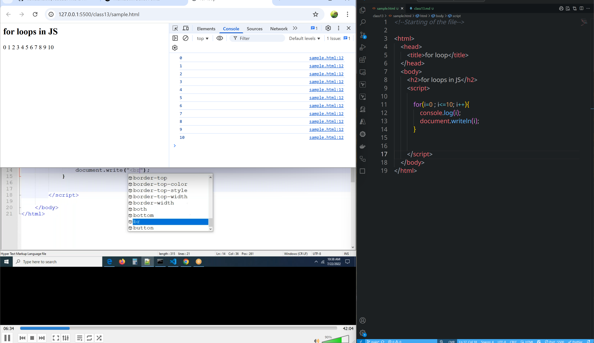
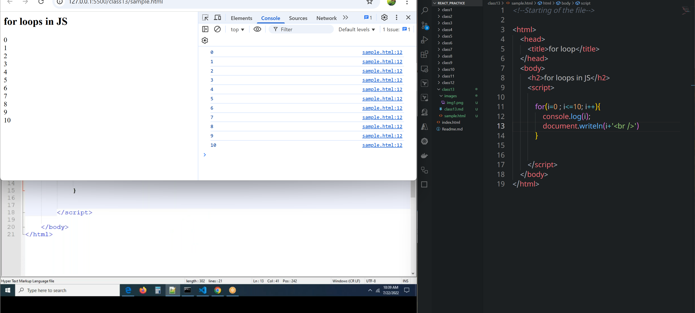
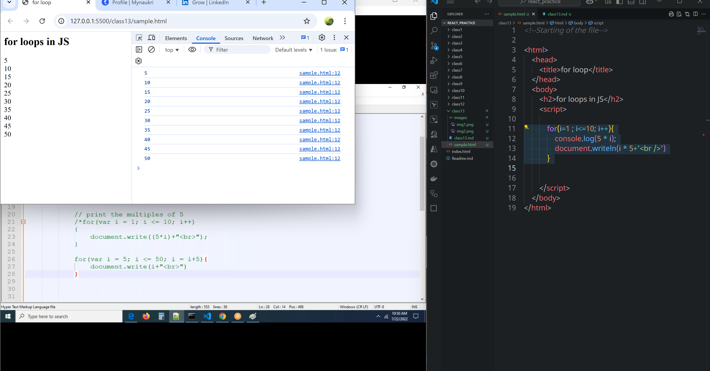
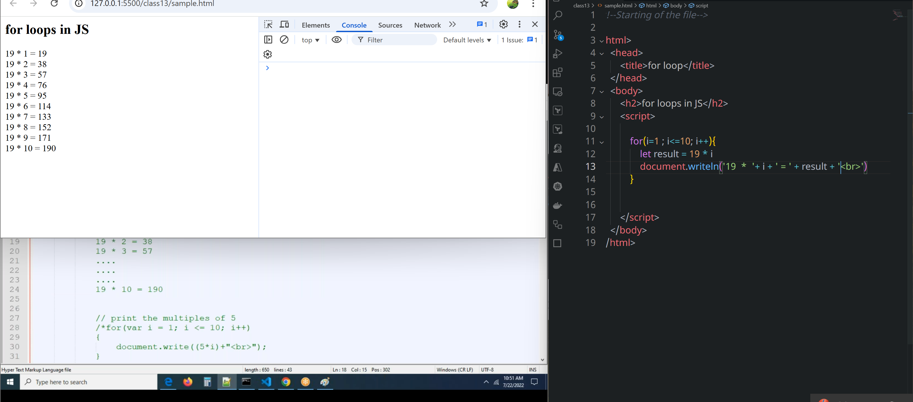
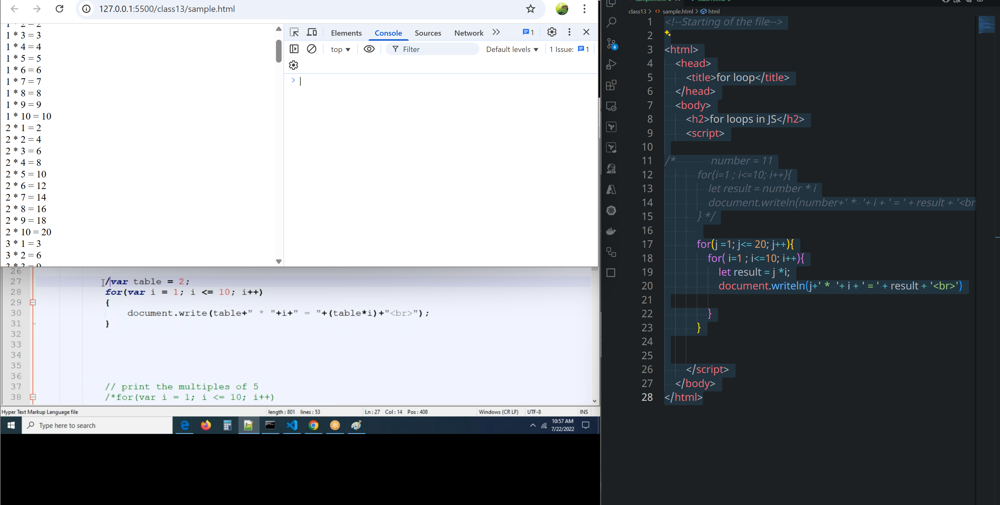
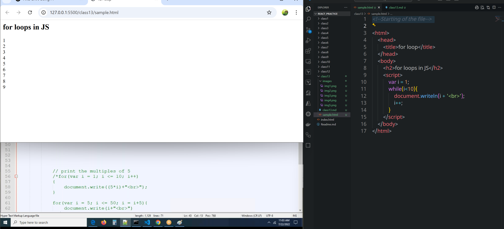
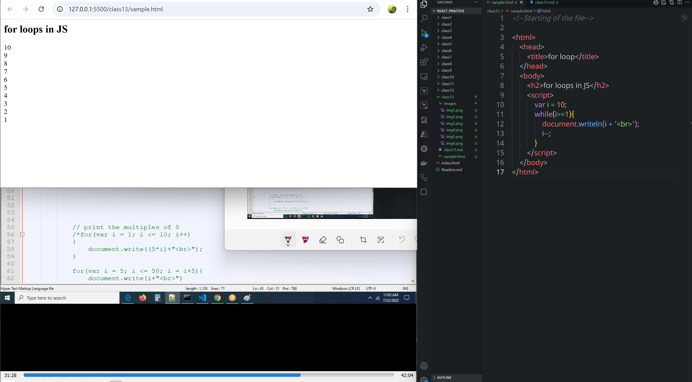
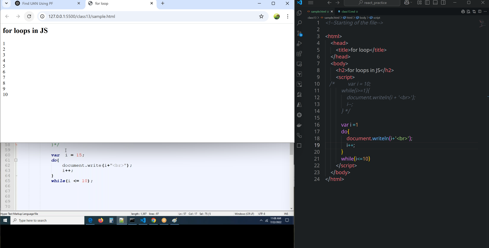
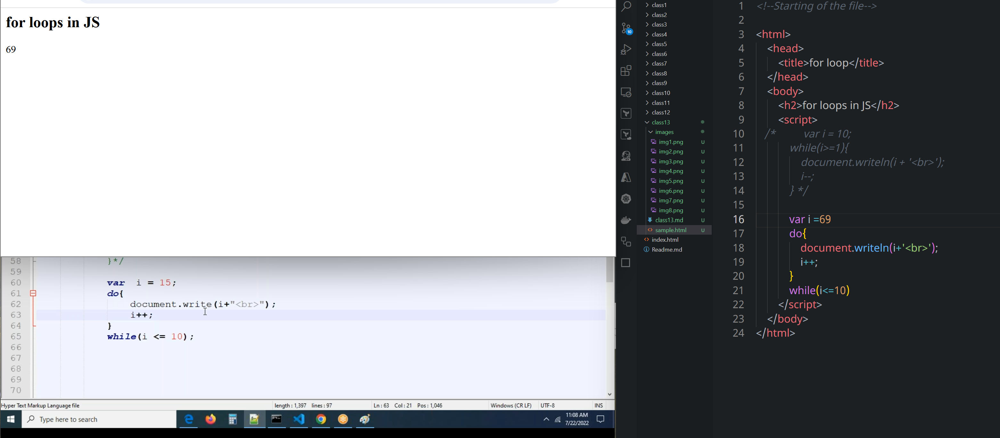

# class 12
# for loop
* if we want to execute block of code when condition is true.



printing 19 table like `19 * 1 = 19`

```html
<!--Starting of the file-->

<html>
    <head>
        <title>for loop</title>
    </head>
    <body>
        <h2>for loops in JS</h2>
        <script>

            number = 11
            for(i=1 ; i<=10; i++){
                let result = number * i
                document.writeln(number+' *  '+ i + ' = ' + result + '<br>')
            }


        </script>
    </body>
</html>
```
## For printing 2 - 20 tables
```html
<!--Starting of the file-->

<html>
    <head>
        <title>for loop</title>
    </head>
    <body>
        <h2>for loops in JS</h2>
        <script>

/*             number = 11
            for(i=1 ; i<=10; i++){
                let result = number * i
                document.writeln(number+' *  '+ i + ' = ' + result + '<br>')
            } */
            
            for(j =1; j<= 20; j++){
                for( i=1 ; i<=10; i++){
                    let result = j *i;
                    document.writeln(j+' *  '+ i + ' = ' + result + '<br>')

                }
            }


        </script>
    </body>
</html>
```

## Assignment
* print prime numberes between 2 to 20
* print even numbers in between 1 and 10
* print odd numbers in between 1 and 10
  


  # while loop
  Sure! Let's dive into the **`while` loop** in JavaScript:


---

## 🔁 What is a `while` loop?

A `while` loop **repeats a block of code** **as long as a given condition is true**.

---

### 🔤 Syntax:

```javascript
initialisation 
while (condition) {
  // code to run repeatedly
  increment| decrement
}
```

* **`condition`** is checked **before** each loop.
* If it's `true`, the loop runs.
* If it's `false`, the loop stops.

---

### ✅ Example 1: Counting from 1 to 5

```javascript
let i = 1;

while (i <= 5) {
  console.log(i);
  i++;
}
```

#### 🧠 How this works:

* Start with `i = 1`
* Print `i`
* Increment `i` by 1
* Loop continues until `i` becomes 6 (condition fails)

**🖨 Output:**

```
1
2
3
4
5
```

---

### ⚠️ Important:

If you forget to update the condition inside the loop (like increasing `i`), it may cause an **infinite loop**.

```javascript
// ⚠️ Infinite loop example
let x = 1;
while (x <= 5) {
  console.log(x);  // x never increases!
}
```

---

### ✅ Example 2: Loop Until User Says "stop"

```javascript
let input;

while (input !== "stop") {
  input = prompt("Type 'stop' to end:");
}
```

This loop keeps asking the user for input until they type "stop".

---

### 🆚 `while` vs `do...while`

* `while`: checks condition **before** running the loop
* `do...while`: runs the code **at least once**, then checks condition

```javascript
let x = 10;
do {
  console.log(x);
} while (x < 5);  // Runs once even though condition is false
```

# do while
## syntax
```js
do{
    //statements
    incremental | decremental 
}
while(condition);
```

* atleast one block of code is executed eventhough condition is false.

 