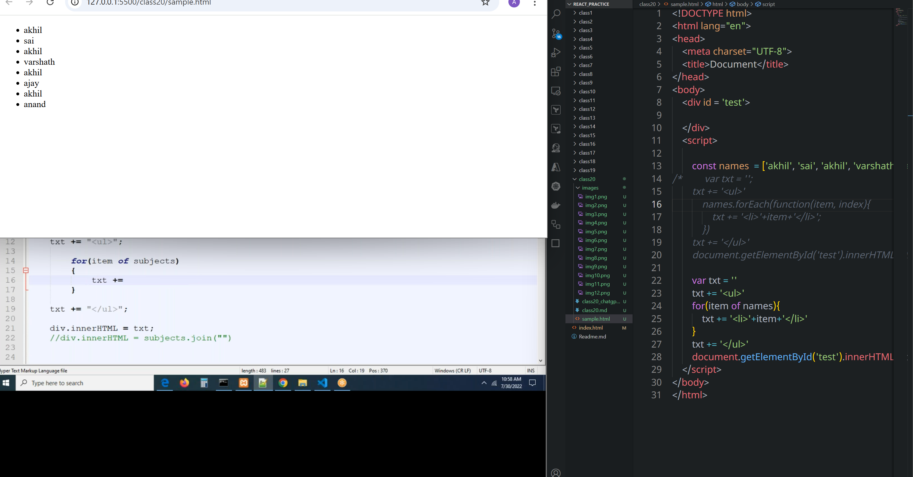

# class 20
# sort() and Array iteration method
## sort()
* This method can sort string values properly, it can not sort if the values are numbers
#### how can we sort numerical values in arrays?
* by using compare method with sort(), we can acheive it
```html
<!DOCTYPE html>
<html lang="en">
<head>
    <meta charset="UTF-8">
    <title>Document</title>
</head>
<body>
    <script>
        
        const names = ['akhil', 'sai', 'varshath', 'sai', 'vishnu'];
        const num = [82, 34, 54, 26 , 46, 12, 23];
/*         num.sort(function(a, b){
            return a -b;
        })
        console.log(num);
 */
        num.sort((a,b)=> a-b)
        console.log(num)
    </script>
</body>
</html>
```


#### Heighest and lowest value in array 
```html
<!DOCTYPE html>
<html lang="en">
<head>
    <meta charset="UTF-8">
    <title>Document</title>
</head>
<body>
    <script>
        const names = ['akhil', 'sai', 'varshath', 'sai', 'vishnu'];
        const num = [82, 34, 54, 26 , 46, 12, 23];
/*         num.sort(function(a, b){
            return a -b;
        })
        console.log(num);
 */ 
        num.sort((a,b)=> a-b)
        console.log(num)
        console.log('the heighest value is: '+num[num.length -1])
        console.log('The lowest value in array: '+ num[0])

    </script>
</body>
</html>
```

```js
console.log(Math.max.apply(null, arr))
console.log(Math.min.apply(null, arr))

```


### object sorting
* names must sort according to alphabetical order
##### object is sorted according to the pincode(number)


##### object sorting according to name(string)
You can sort the array of objects by the `firstname` property using JavaScript's `.sort()` method. Here's how you can do it:

```javascript
const users = [
    { firstname: "Ram", lastname: "Babburi", city: "Ongole", pincode: 500032 },
    { firstname: "Anand", lastname: "Pabbineedi", city: "Kakinada", pincode: 533001 },
    { firstname: "Vinod", lastname: "Katte", city: "Anantapur", pincode: 515671 },
    { firstname: "Lakshman", lastname: "D", city: "Kakinada", pincode: 533006 },
    { firstname: "Sri Raj", lastname: "Kamisetti", city: "Amalapuram", pincode: 533249 }
];

users.sort((a, b) => a.firstname.localeCompare(b.firstname));

console.log(users);
```

### Explanation:

* `Array.prototype.sort()` sorts the array **in place**.
* `localeCompare()` is used for proper string comparison, respecting alphabetical order and locale rules.

### Output (sorted by `firstname`):

```js
[
  { firstname: "Anand", ... },
  { firstname: "Lakshman", ... },
  { firstname: "Ram", ... },
  { firstname: "Sri Raj", ... },
  { firstname: "Vinod", ... }
]
```

Let me know if you want it sorted in descending order instead.

```html
<!DOCTYPE html>
<html lang="en">
<head>
    <meta charset="UTF-8">
    <title>Document</title>
</head>
<body>
    <script>
         const users = [
                { firstname: "Ram", lastname: "Babburi", city: "Ongole", pincode: 500032 },
                { firstname: "Anand", lastname: "Pabbineedi", city: "Kakinada", pincode: 533001 },
                { firstname: "Vinod", lastname: "Katte", city: "Anantapur", pincode: 515671 },
                { firstname: "Lakshman", lastname: "D", city: "Kakinada", pincode: 533006 },
                { firstname: "Sri Raj", lastname: "Kamisetti", city: "Amalapuram", pincode: 533249 }
            ];
            users.sort(function(a, b){
                return a.firstname.localeCompare(b.firstname);
            });
            console.log(users)
    </script>
</body>
</html>
```


# Array iteration method
* **foreach()**
* **for(of)**
* **map()**
* **filter()**
* **every()**
* **some()**
* **findIndex()**
* **findLastIndex()**
* **reduce()**
**Note:-**
* Without  `map()` and `filter()` there is no React JS
## for of
```html
<!DOCTYPE html>
<html lang="en">
<head>
    <meta charset="UTF-8">
    <title>Document</title>
</head>
<body>
    <div id = 'test'>

    </div>
    <script>

        const names  = ['akhil', 'sai', 'akhil', 'varshath','akhil', 'ajay', 'akhil', 'akhil'];
        var txt = '';
        txt += '<ul>';
            for(var i=0; i<names.length;i++){
                txt += '<li>'+names[i]+'</li>'
            }
        txt += '</ul>'
        document.getElementById('test').innerHTML = txt

    </script>
</body>
</html>
```

#### alternative to for() loop
```html
<!DOCTYPE html>
<html lang="en">
<head>
    <meta charset="UTF-8">
    <title>Document</title>
</head>
<body>
    <div id = 'test'>

    </div>
    <script>

        const names  = ['akhil', 'sai', 'akhil', 'varshath','akhil', 'ajay', 'akhil', 'anand'];
        var txt = '';
/*         txt += '<ul>';
            for(var i=0; i<names.length;i++){
                txt += '<li>'+names[i]+'</li>'
            }
        txt += '</ul>'
        document.getElementById('test').innerHTML = txt
 */
        for(item of names){
            console.log(item)
        }
    </script>
</body>
</html>
```

```html
<!DOCTYPE html>
<html lang="en">
<head>
    <meta charset="UTF-8">
    <title>Document</title>
</head>
<body>
    <div id = 'test'>

    </div>
    <script>

        const names  = ['akhil', 'sai', 'akhil', 'varshath','akhil', 'ajay', 'akhil', 'anand'];
        var txt = '';
/*         txt += '<ul>';
            for(var i=0; i<names.length;i++){
                txt += '<li>'+names[i]+'</li>'
            }
        txt += '</ul>'
        document.getElementById('test').innerHTML = txt
 */
        txt += ''
        txt += '<ul>'
        for(item of names){
            txt += '<li>'+item+'</li>'
                }
        txt += '</ul>'
        document.getElementById('test').innerHTML = txt
    </script>
</body>
</html>
```

### The methods of array iteration
#### for of()
#### foreach();
* By using this method,  we can Iterafate each and every item of an array
* this method has a call back function as a parameter
* this call back funciton accepts three properties
```js
arr.forEach(function(x, y, z ){
    variable x  - holds or contain each and every element of the array
    variable y - holds  index of an element
    variable z - holds the current array

});
```

In JavaScript, `forEach` is a method used to loop over arrays. It executes a provided function once for each array element.

### Syntax:

```javascript
array.forEach(function(element, index, array) {
  // your code here
});
```

* `element`: The current element in the array.
* `index` *(optional)*: The index of the current element.
* `array` *(optional)*: The array that `forEach` was called on.

### Example:

```javascript
const fruits = ['apple', 'banana', 'cherry'];

fruits.forEach(function(fruit, index) {
  console.log(index + ': ' + fruit);
});
```

**Output:**

```
0: apple
1: banana
2: cherry
```

### With Arrow Function:

```javascript
fruits.forEach((fruit, index) => {
  console.log(`${index}: ${fruit}`);
});
```

### Important Notes:

* `forEach` does **not** return anything.
* You **cannot** use `break` or `continue` inside `forEach`.
* If you need early exits, use a regular `for` loop or `for...of`.

Would you like a comparison between `forEach`, `map`, and `for...of`?
* forEach() does not return any value
```html
<!DOCTYPE html>
<html lang="en">
<head>
    <meta charset="UTF-8">
    <title>Document</title>
</head>
<body>
    <div id = 'test'>

    </div>
    <script>

        const names  = ['akhil', 'sai', 'akhil', 'varshath','akhil', 'ajay', 'akhil', 'anand'];
        var txt = '';
        txt += '<ul>'
            names.forEach(function(item, index, arr){
                txt += '<li>'+item+'</li>';
            })
        txt += '</ul>'
        document.getElementById('test').innerHTML = txt
    </script>
</body>
</html>
```


```html
<!DOCTYPE html>
<html lang="en">
<head>
    <meta charset="UTF-8">
    <title>Document</title>
</head>
<body>
    <div id = 'test'>

    </div>
    <script>

        const names  = ['akhil', 'sai', 'akhil', 'varshath','akhil', 'ajay', 'akhil', 'anand'];
/*         var txt = '';
        txt += '<ul>'
            names.forEach(function(item, index){
                txt += '<li>'+item+'</li>';
            })
        txt += '</ul>'
        document.getElementById('test').innerHTML = txt */
        
        var txt = ''
        txt += '<ul>'
        for(item of names){
            txt += '<li>'+item+'</li>'
        }
        txt += '</ul>'
        document.getElementById('test').innerHTML = txt;
    </script>
</body>
</html>
```

* forEach() does not apply on string. It can apply only on the array
* forEach( ) does not return any value.


* for(of) works for strings as well as arrays
# map()
* By using this method we can iterate each and every item in an array
* this method has a call back function as a parameter
* this call back function accepts three parameters
* after iterating map method returns an new array
A **callback function** is a function that is passed as an **argument** to another function and is **executed later**, typically after some kind of operation is completed.

In your example:

```javascript
const na = names.map(function(item, index){
    return 'index:' + item
});
```

### Here's what's happening:

* `names.map(...)` is calling the **`map()`** method on the array `names`.
* `map()` expects a **callback function** — in this case:

  ```javascript
  function(item, index) {
      return 'index:' + item;
  }
  ```
* This callback function is called **once for each item** in the `names` array.
* The callback takes 3 parameters (you've used 2):

  * `item` → the current element in the array
  * `index` → the current index of that element
  * `array` → the original array itself (optional)

### So what does "callback function" mean here?

It means the function:

* Is **not executed immediately**
* Is **invoked (called back)** by `map()` for each item in the array
* Is used to **transform or process** each element

### Output example:

With your code:

```javascript
const names  = ['akhil', 'sai', 'akhil', 'varshath','akhil', 'ajay', 'akhil', 'anand'];

const na = names.map(function(item, index){
    return 'index:' + item
})
console.log(na)
```

The result printed will be:

```javascript
[
  'index:akhil',
  'index:sai',
  'index:akhil',
  'index:varshath',
  'index:akhil',
  'index:ajay',
  'index:akhil',
  'index:anand'
]
```

### Summary:

A **callback function** in `map()` is just a function that gets called for **each item** in the array, letting you define how each item should be **transformed**.

```html
<!DOCTYPE html>
<html lang="en">
<head>
    <meta charset="UTF-8">
    <title>Document</title>
</head>
<body>
    <div id = 'test'>

    </div>
    <script>

        const names  = ['akhil', 'sai', 'akhil', 'varshath','akhil', 'ajay', 'akhil', 'anand'];

        const na = names.map(function(item, index){
            return 'index:' + item
        })
        console.log(na)
        
    </script>
</body>
</html>
```

```html
<!DOCTYPE html>
<html lang="en">
<head>
    <meta charset="UTF-8">
    <title>Document</title>
</head>
<body>
    <div id = 'test'>

    </div>
    <script>

        const names  = ['akhil', 'sai', 'akhil', 'varshath','akhil', 'ajay', 'akhil', 'anand'];

        let txt = '';
        txt += '<ul>'
        names.map((item, index, Array) =>{
            txt += '<li>'+item+'</li>';
        })
        txt += '</ul>'
        document.getElementById('test').innerHTML = txt;
        
    </script>
</body>
</html>
```


