# class23
## strings in Java Script or string library in JS
JavaScript doesn’t have a separate "string library" like some other languages, but it has a **powerful built-in `String` object** with many methods that let you manipulate and work with strings easily.

Here’s a quick overview of the most commonly used **JavaScript string methods** (a built-in "string library"):

---

### 🔤 **Basic String Methods**

| Method        | Description                            | Example                            |
| ------------- | -------------------------------------- | ---------------------------------- |
| `length`      | Returns the length of the string       | `'hello'.length // 5`              |
| `charAt()`    | Returns the character at a given index | `'hello'.charAt(1) // 'e'`         |
| `slice()`     | Extracts a section of a string         | `'hello'.slice(1, 4) // 'ell'`     |
| `substring()` | Similar to `slice`                     | `'hello'.substring(1, 4) // 'ell'` |
| `substr()` ❌  | Deprecated — use `slice()` instead     |                                    |

---

### 🔍 **Searching Methods**

| Method          | Description                                | Example                                |
| --------------- | ------------------------------------------ | -------------------------------------- |
| `indexOf()`     | Finds the first index of a substring       | `'hello'.indexOf('e') // 1`            |
| `lastIndexOf()` | Finds the last index of a substring        | `'hello hello'.lastIndexOf('o') // 10` |
| `includes()`    | Checks if a string contains another string | `'hello'.includes('ll') // true`       |
| `startsWith()`  | Checks if string starts with given text    | `'hello'.startsWith('he') // true`     |
| `endsWith()`    | Checks if string ends with given text      | `'hello'.endsWith('lo') // true`       |

---

### 🔧 **Manipulation Methods**

| Method          | Description                       | Example                                |
| --------------- | --------------------------------- | -------------------------------------- |
| `toUpperCase()` | Converts to uppercase             | `'hello'.toUpperCase() // 'HELLO'`     |
| `toLowerCase()` | Converts to lowercase             | `'HELLO'.toLowerCase() // 'hello'`     |
| `trim()`        | Removes whitespace from both ends | `'  hello  '.trim() // 'hello'`        |
| `replace()`     | Replaces part of string           | `'hello'.replace('l', 'x') // 'hexlo'` |
| `replaceAll()`  | Replaces all occurrences          | `'lol'.replaceAll('l', 'x') // 'xox'`  |
| `repeat()`      | Repeats string multiple times     | `'ha'.repeat(3) // 'hahaha'`           |
| `split()`       | Splits string into array          | `'a,b,c'.split(',') // ['a','b','c']`  |
| `concat()`      | Joins strings                     | `'Hello'.concat(' ', 'World')`         |

---

### 🧠 Advanced: Template Literals

Use **backticks (\`)** for multiline strings or inserting variables:

```js
const name = "Ram";
const message = `Hello, ${name}!`;
console.log(message); // "Hello, Ram!"
```

---

Let me know if you want examples of **string validation**, **pattern matching with regex**, or **real-world string formatting**!

### Sir's notes
* A string is a collection of characters or group of words
* Strings are declared by using double quotes("") or Single quote('')
* var txt = 'hello world';
```js
var str = 'welcome to js'
```
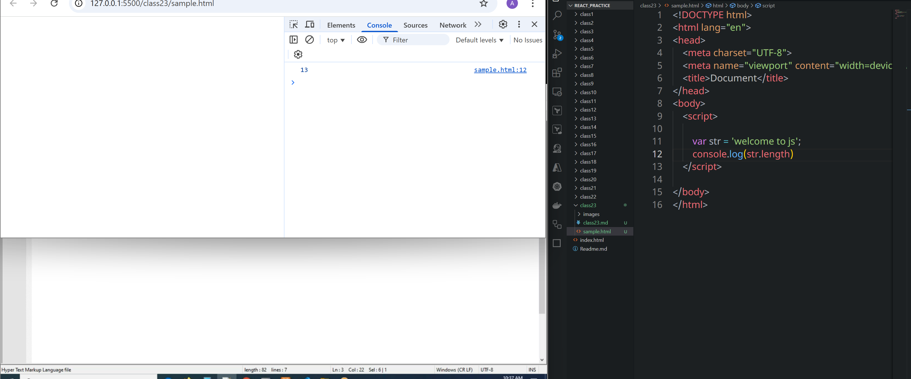
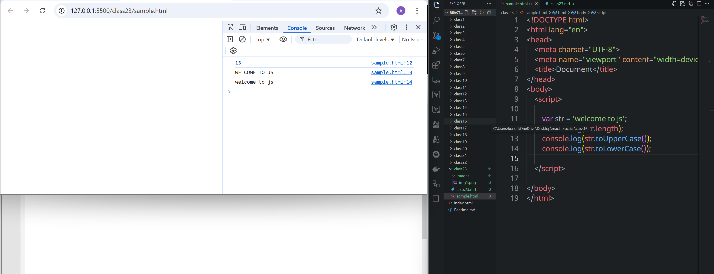
#### convert an array into string
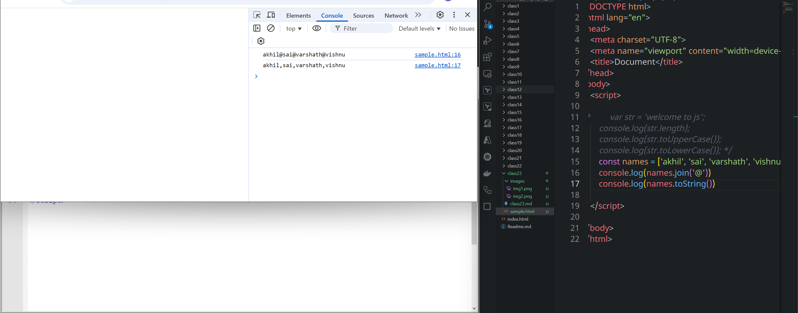
#### convert string to array
```html
<!DOCTYPE html>
<html lang="en">
<head>
    <meta charset="UTF-8">
    <meta name="viewport" content="width=device-width, initial-scale=1.0">
    <title>Document</title>
</head>
<body>
    <script>

/*         var str = 'welcome to js';
        console.log(str.length);
        console.log(str.toUpperCase());
        console.log(str.toLowerCase()); */
/*         const names = ['akhil', 'sai', 'varshath', 'vishnu'];
        console.log(names.join('@'))
        console.log(names.toString())
 */

        const arr = 'akhil is very good boy';
        console.log(arr.split(' '))
    </script>
    
</body>
</html>
```
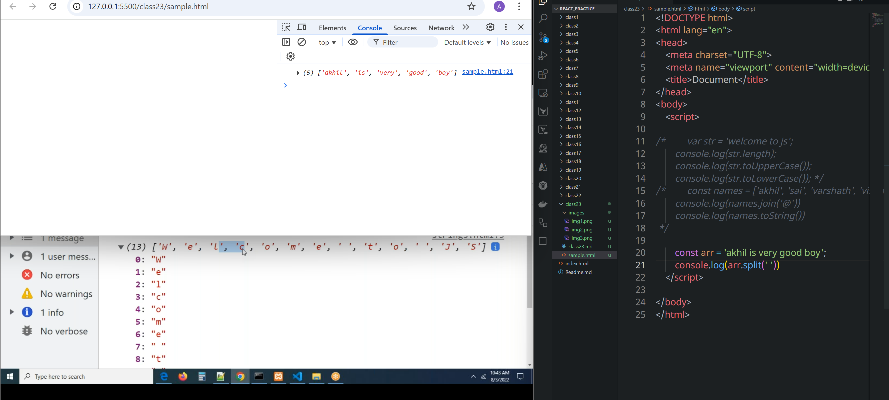
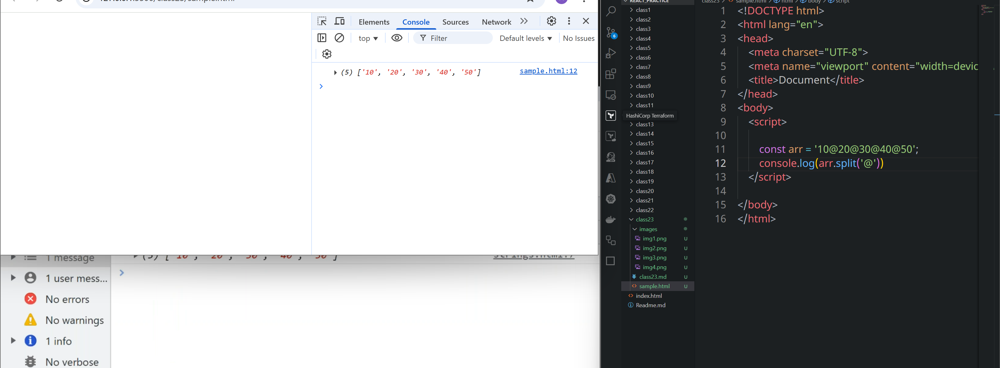
## slice(), substring(), substr() methods
* Start index should be lower than end index
###  slice()
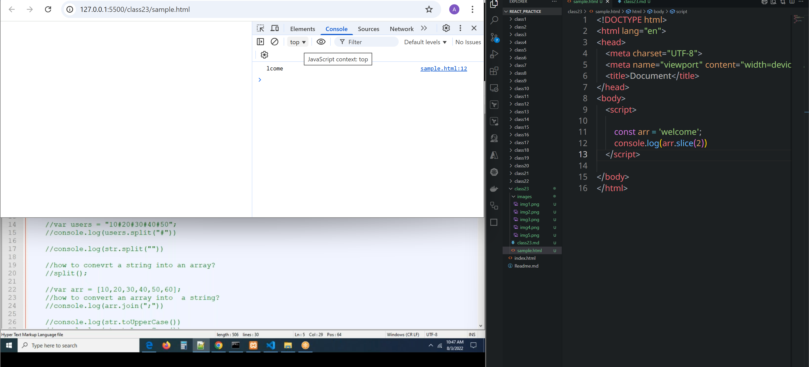
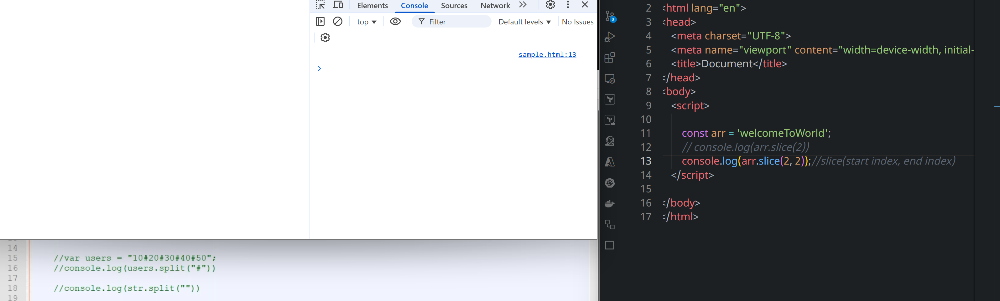
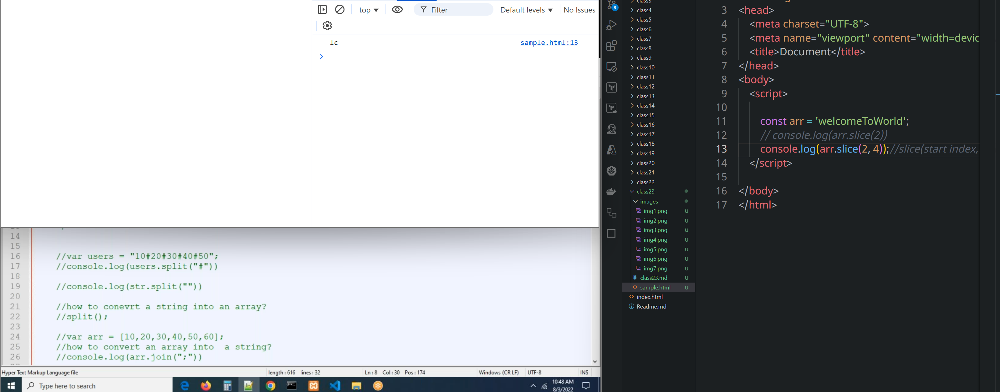
* This method accepts negative index
 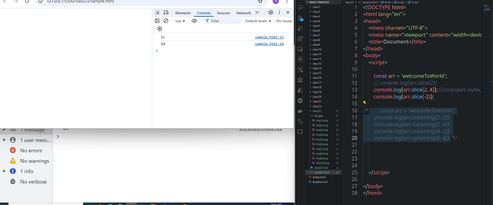

### substring() 
* substring does not accept negative index's
* it take end index value higher than start index value
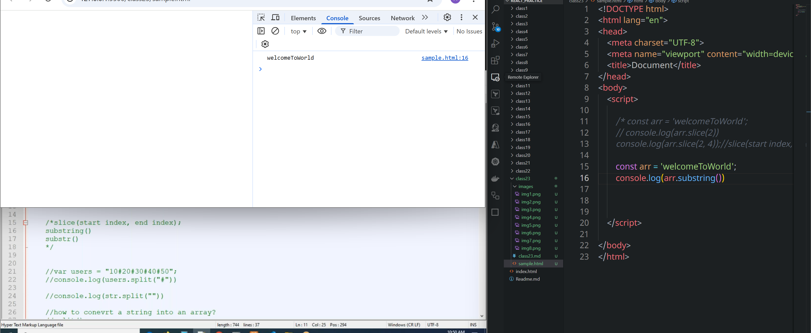
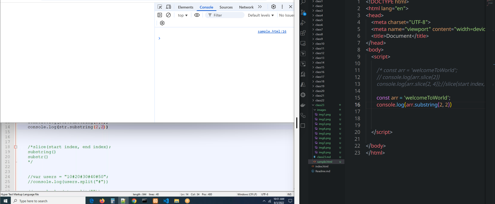
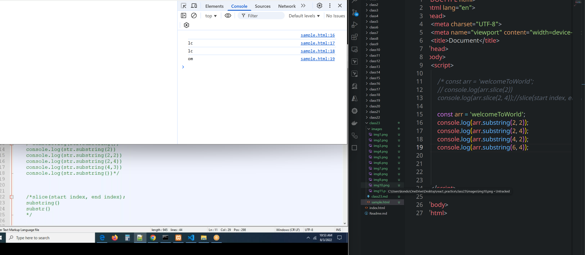
### difference
* Both methods are for cutting a string only the difference between these methods is slice method accepts negative index's and sub strinng method does not accept negative index's
The `slice()` and `substring()` methods are both used in JavaScript to extract parts of a string, but they have some key differences in behavior. Here's a comparison:

---

### 🔹 `slice(start, end)`

* **Parameters**:

  * `start`: index to begin extraction (inclusive)
  * `end`: index to end extraction (exclusive)
* **Accepts negative indices**: Yes
* **Returns**: A new string from `start` to `end` (not including `end`)

**Example:**

```javascript
let str = "JavaScript";
str.slice(0, 4);      // "Java"
str.slice(-6, -3);    // "Scr"
```

---

### 🔹 `substring(start, end)`

* **Parameters**:

  * `start`: index to begin extraction (inclusive)
  * `end`: index to end extraction (exclusive)
* **Accepts negative indices**: No (negative values are treated as `0`)
* **Automatically swaps indices if `start > end`**: Yes

**Example:**

```javascript
let str = "JavaScript";
str.substring(0, 4);      // "Java"
str.substring(4, 0);      // Also "Java" (swaps the arguments)
str.substring(-3, 4);     // Treated as (0, 4) → "Java"
```

---

### 🔸 Summary of Differences:

| Feature                     | `slice()`        | `substring()`       |
| --------------------------- | ---------------- | ------------------- |
| Negative indices allowed    | ✅ Yes            | ❌ No (treated as 0) |
| Index swap if `start > end` | ❌ No             | ✅ Yes               |
| Typical usage               | Strings & arrays | Strings only        |

---

### ✅ Use `slice()` when:

* You want consistent behavior with arrays.
* You want to use negative indices.

### ✅ Use `substring()` when:

* You want automatic handling of swapped indices and are only working with strings.

Let me know if you want to see similar behavior in other languages (like Python).

### substr()
* this method accept's lenght 
```html
<!DOCTYPE html>
<html lang="en">
<head>
    <meta charset="UTF-8">
    <meta name="viewport" content="width=device-width, initial-scale=1.0">
    <title>Document</title>
</head>
<body>
    <script>

        /* const arr = 'welcomeToWorld';
        // console.log(arr.slice(2))
        console.log(arr.slice(2, 4));//slice(start index, end index) */

/*         const arr = 'welcomeToWorld';
        console.log(arr.substring(2, 2));
        console.log(arr.substring(2, 4));
        console.log(arr.substring(4, 2));
        console.log(arr.substring(6, 4)); */

        const arr = 'welcomeToWorld';
        console.log(arr.substr( ));
        console.log(arr.substr(0));
        console.log(arr.substr(3));
        console.log(arr.substr(3, 1));
        console.log(arr.substr(3, 3 ));
        console.log(arr.substr( -3));
        console.log(arr.substr( -7, 3));
    </script>
    
</body>
</html>
```
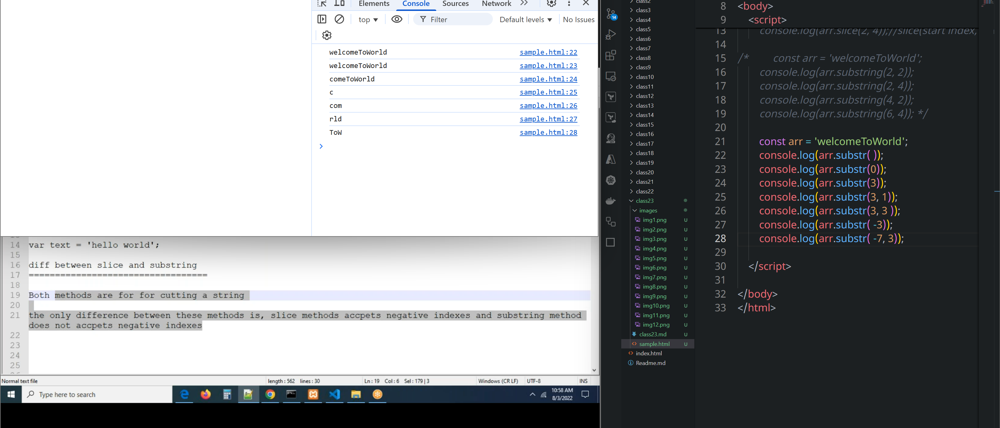
### index()
```html
<!DOCTYPE html>
<html lang="en">
<head>
    <meta charset="UTF-8">
    <meta name="viewport" content="width=device-width, initial-scale=1.0">
    <title>Document</title>
</head>
<body>
    <script>

        /* const arr = 'welcomeToWorld';
        // console.log(arr.slice(2))
        console.log(arr.slice(2, 4));//slice(start index, end index) */

/*         const arr = 'welcomeToWorld';
        console.log(arr.substring(2, 2));
        console.log(arr.substring(2, 4));
        console.log(arr.substring(4, 2));
        console.log(arr.substring(6, 4)); */

/*         const arr = 'welcomeToWorld';
        console.log(arr.substr( ));
        console.log(arr.substr(0));
        console.log(arr.substr(3));
        console.log(arr.substr(3, 1));
        console.log(arr.substr(3, 3 ));
        console.log(arr.substr( -3));
        console.log(arr.substr( -7, 3)); */

        const arr = 'welcomeToWorld akhil';
        console.log(arr.indexOf('lco'));
        console.log(arr.indexOf('akhil'));
        console.log(arr.indexOf('o'));
        console.log(arr.lastIndexOf('o'));
        console.log(arr.includes('lco'));
        console.log(arr.includes('akhil'));
        console.log(arr.includes('sai'));

    </script>
    
</body>
</html>
```
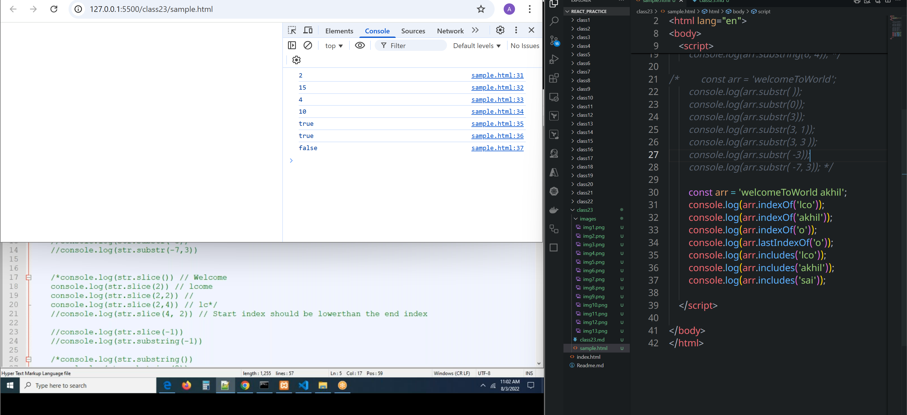

#### how can we remove empty spaces from a string
```html

<!DOCTYPE html>
<html lang="en">
<head>
    <meta charset="UTF-8">
    <meta name="viewport" content="width=device-width, initial-scale=1.0">
    <title>Document</title>
</head>
<body>
    <script>

        /* const arr = 'welcomeToWorld';
        // console.log(arr.slice(2))
        console.log(arr.slice(2, 4));//slice(start index, end index) */

/*         const arr = 'welcomeToWorld';
        console.log(arr.substring(2, 2));
        console.log(arr.substring(2, 4));
        console.log(arr.substring(4, 2));
        console.log(arr.substring(6, 4)); */

/*         const arr = 'welcomeToWorld';
        console.log(arr.substr( ));
        console.log(arr.substr(0));
        console.log(arr.substr(3));
        console.log(arr.substr(3, 1));
        console.log(arr.substr(3, 3 ));
        console.log(arr.substr( -3));
        console.log(arr.substr( -7, 3)); */

/*         const arr = 'welcomeToWorld akhil';
        console.log(arr.indexOf('lco'));
        console.log(arr.indexOf('akhil'));
        console.log(arr.indexOf('o'));
        console.log(arr.lastIndexOf('o'));
        console.log(arr.includes('lco'));
        console.log(arr.includes('akhil'));
        console.log(arr.includes('sai'));
 */

        const name = '          Konduri           Akhil       David         ';
        var newname = name.split(' ').filter(Boolean).join(' ');
        console.log(newname);
    </script>
    
</body>
</html>
```
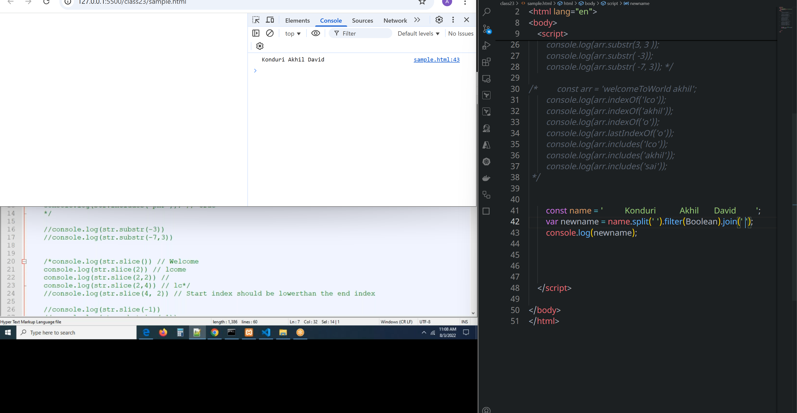

```html
<!DOCTYPE html>
<html lang="en">
<head>
    <meta charset="UTF-8">
    <meta name="viewport" content="width=device-width, initial-scale=1.0">
    <title>Document</title>
</head>
<body>
    <script>

        /* const arr = 'welcomeToWorld';
        // console.log(arr.slice(2))
        console.log(arr.slice(2, 4));//slice(start index, end index) */

/*         const arr = 'welcomeToWorld';
        console.log(arr.substring(2, 2));
        console.log(arr.substring(2, 4));
        console.log(arr.substring(4, 2));
        console.log(arr.substring(6, 4)); */

/*         const arr = 'welcomeToWorld';
        console.log(arr.substr( ));
        console.log(arr.substr(0));
        console.log(arr.substr(3));
        console.log(arr.substr(3, 1));
        console.log(arr.substr(3, 3 ));
        console.log(arr.substr( -3));
        console.log(arr.substr( -7, 3)); */

/*         const arr = 'welcomeToWorld akhil';
        console.log(arr.indexOf('lco'));
        console.log(arr.indexOf('akhil'));
        console.log(arr.indexOf('o'));
        console.log(arr.lastIndexOf('o'));
        console.log(arr.includes('lco'));
        console.log(arr.includes('akhil'));
        console.log(arr.includes('sai'));
 */


        const name = '          Konduri           Akhil       David         ';
        var newname = name.split(' ');
        var txt = '';
        for(const item of newname){
            item ? txt +=( item+ ' ') : ' ';
        }

        console.log(txt)

    </script>
    
</body>
</html>
```
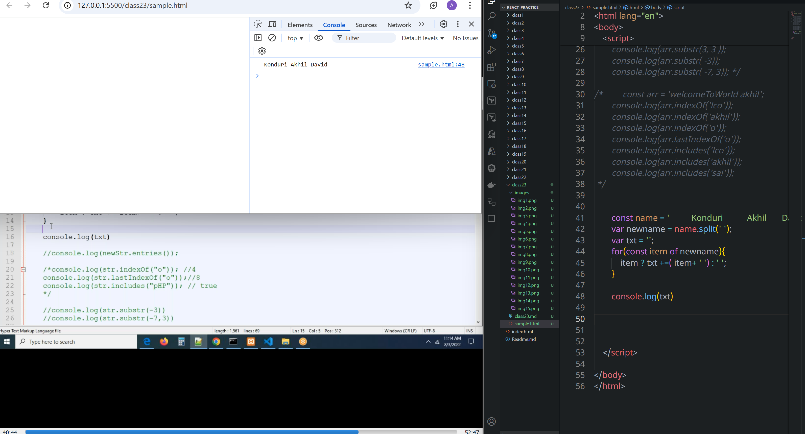
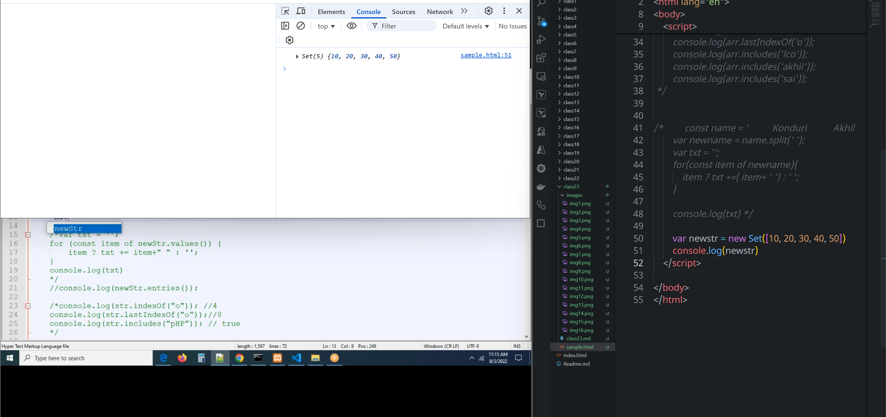
### object to an array
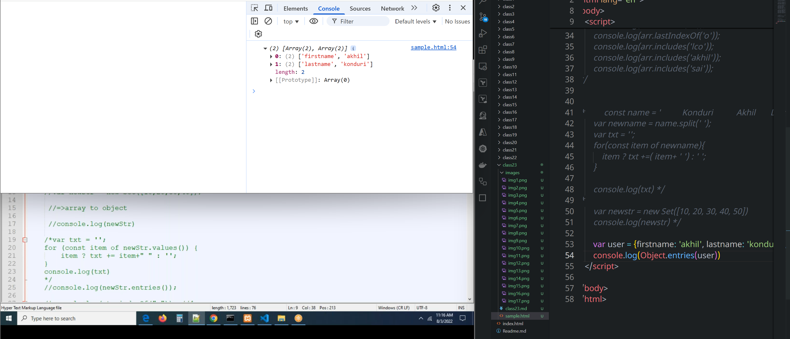
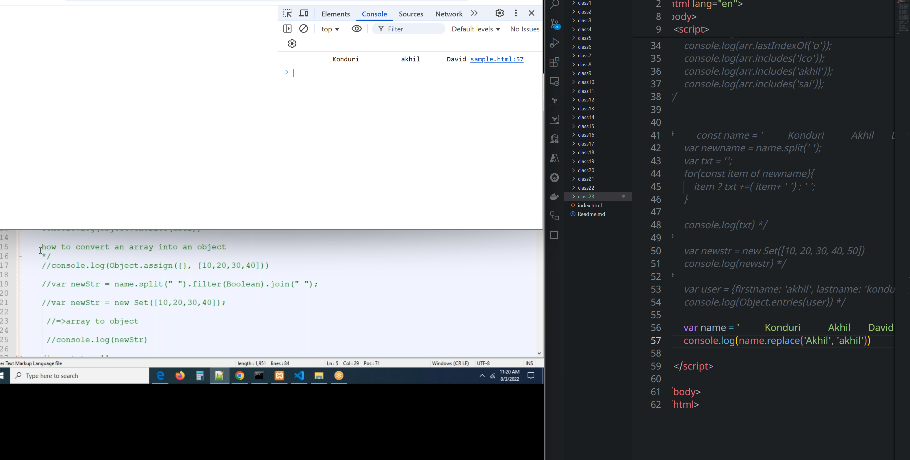

```html
<!DOCTYPE html>
<html lang="en">
<head>
    <meta charset="UTF-8">
    <meta name="viewport" content="width=device-width, initial-scale=1.0">
    <title>Document</title>
</head>
<body>
    <script>

        /* const arr = 'welcomeToWorld';
        // console.log(arr.slice(2))
        console.log(arr.slice(2, 4));//slice(start index, end index) */

/*         const arr = 'welcomeToWorld';
        console.log(arr.substring(2, 2));
        console.log(arr.substring(2, 4));
        console.log(arr.substring(4, 2));
        console.log(arr.substring(6, 4)); */

/*         const arr = 'welcomeToWorld';
        console.log(arr.substr( ));
        console.log(arr.substr(0));
        console.log(arr.substr(3));
        console.log(arr.substr(3, 1));
        console.log(arr.substr(3, 3 ));
        console.log(arr.substr( -3));
        console.log(arr.substr( -7, 3)); */

/*         const arr = 'welcomeToWorld akhil';
        console.log(arr.indexOf('lco'));
        console.log(arr.indexOf('akhil'));
        console.log(arr.indexOf('o'));
        console.log(arr.lastIndexOf('o'));
        console.log(arr.includes('lco'));
        console.log(arr.includes('akhil'));
        console.log(arr.includes('sai'));
 */


/*         const name = '          Konduri           Akhil       David         ';
        var newname = name.split(' ');
        var txt = '';
        for(const item of newname){
            item ? txt +=( item+ ' ') : ' ';
        }

        console.log(txt) */
/* 
        var newstr = new Set([10, 20, 30, 40, 50])
        console.log(newstr) */
/* 
        var user = {firstname: 'akhil', lastname: 'konduri'};
        console.log(Object.entries(user)) */

        var name = '          Konduri           akhil       David      akhil  akhil   ';
        console.log(name.replace('akhil', 'sai'))
        console.log(name.replace(/akhil/ig, 'Sai Varshath'))

    </script>
    
</body>
</html>
```
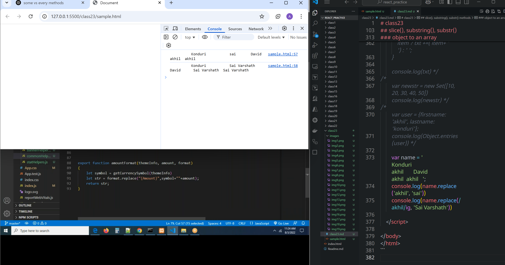
