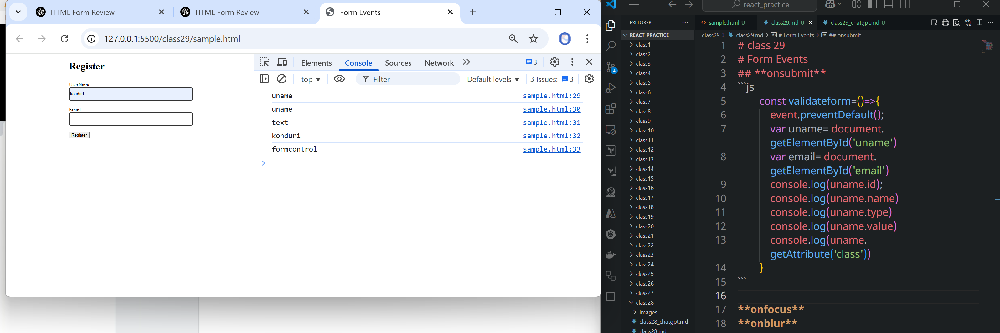
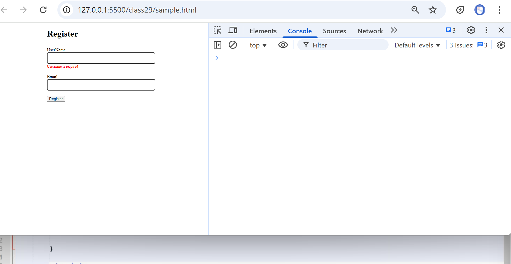
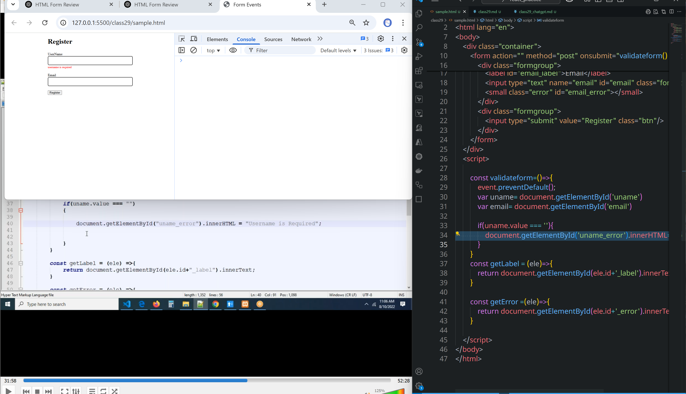
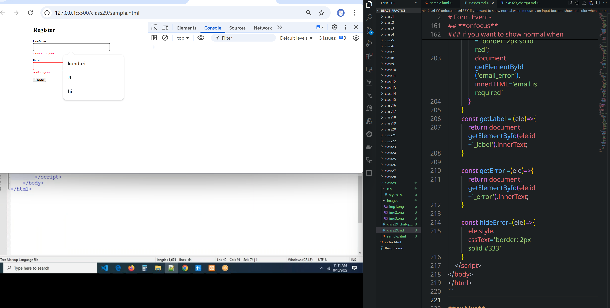
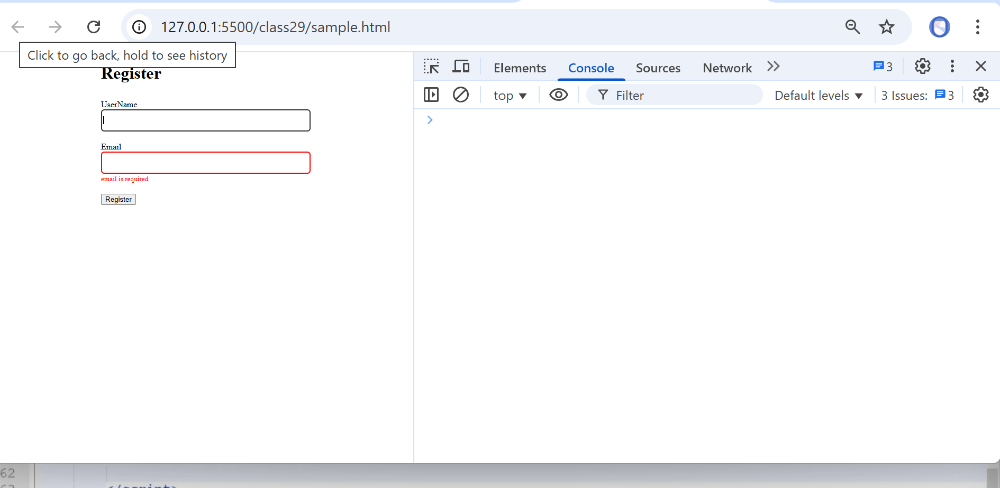
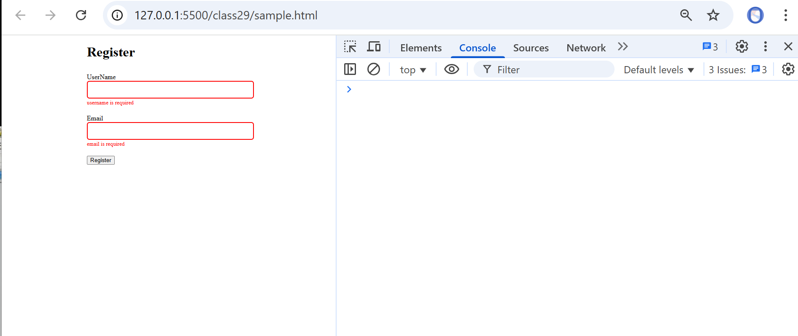
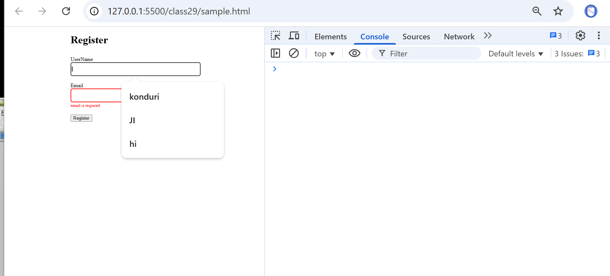
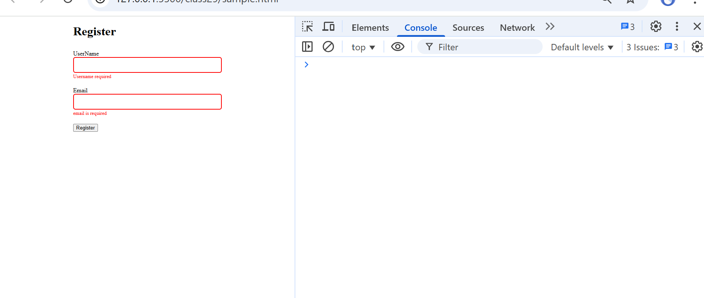
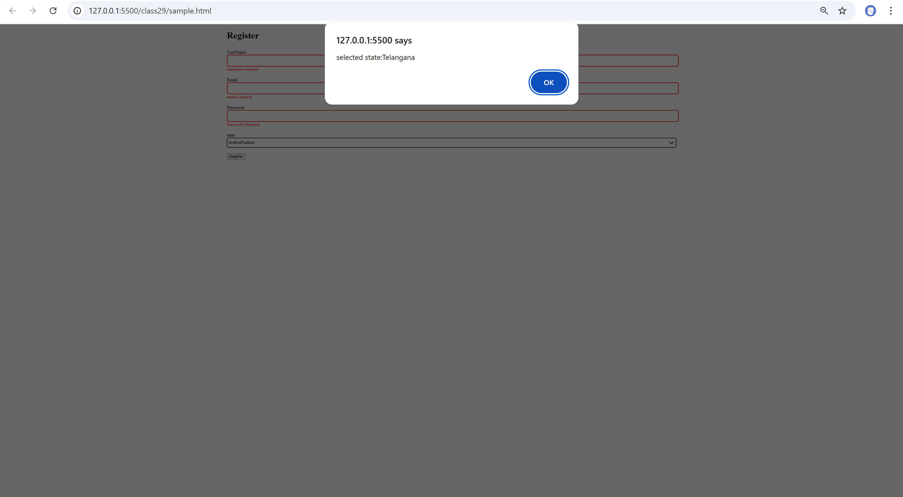

# class 29
# Form Events
## **onsubmit**
```html
<!DOCTYPE html>
<html lang="en">
<head>
    <title>Form Events</title>
    <link rel="stylesheet" href="css/styles.css" />
</head>
<body>
    <div class="container">
        <h1>Register</h1>
        <form action="" method="post" onsubmit="validateform() ; return false;">
            <div class="formgroup">
                <label>UserName</label>
                <input type="text" name="uname" id="uname" class="formcontrol"/>
            </div>
            <div class="formgroup">
                <label>Email</label>
                <input type="text" name="email" id="email" class="formcontrol"/>
            </div>
            <div class="formgroup">
                <input type="submit" value="Register" class="btn"/>
            </div>
        </form>
    </div>
    <script>
        const validateform=()=>{
            event.preventDefault();
            var uname= document.getElementById('uname')
            var email= document.getElementById('email')
            console.log(uname.id);
            console.log(uname.name)
            console.log(uname.type)
            console.log(uname.value)
            console.log(uname.getAttribute('class'))
        }
    </script>    
</body>
</html>
```

```js
        const validateform=()=>{
            event.preventDefault();
            var uname= document.getElementById('uname')
            var email= document.getElementById('email')

            if (uname.value === '' || email.value === '')
        {
            alert('all Fields are required')
        }
        else
        {
            console.log('posting data to server')
        }
        }
```
```html
<!DOCTYPE html>
<html lang="en">
<head>
    <title>Form Events</title>
    <link rel="stylesheet" href="css/styles.css" />
</head>
<body>
    <div class="container">
        <h1>Register</h1>
        <form action="" method="post" onsubmit="validateform() ; return false;">
            <div class="formgroup">
                <label id ='uname_label'>UserName</label>
                <input type="text" name="uname" id="uname" class="formcontrol"/>
                <small class="error" id="uname_error"></small>
            </div>
            <div class="formgroup">
                <label id="email_label">Email</label>
                <input type="text" name="email" id="email" class="formcontrol"/>
                <small class="error" id="email_error"></small>
            </div>
            <div class="formgroup">
                <input type="submit" value="Register" class="btn"/>
            </div>
        </form>
    </div>
    <script>

        const validateform=()=>{
            event.preventDefault();
            var uname= document.getElementById('uname')
            var email= document.getElementById('email')

            if(uname.value === ''){
                document.getElementById('uname_error').innerHTML='Username is required'
            }
        }

    </script>    
</body>
</html>
```

```html
<!DOCTYPE html>
<html lang="en">
<head>
    <title>Form Events</title>
    <link rel="stylesheet" href="css/styles.css" />
</head>
<body>
    <div class="container">
        <h1>Register</h1>
        <form action="" method="post" onsubmit="validateform() ; return false;">
            <div class="formgroup">
                <label id ='uname_label'>UserName</label>
                <input type="text" name="uname" id="uname" class="formcontrol"/>
                <small class="error" id="uname_error"></small>
            </div>
            <div class="formgroup">
                <label id="email_label">Email</label>
                <input type="text" name="email" id="email" class="formcontrol"/>
                <small class="error" id="email_error"></small>
            </div>
            <div class="formgroup">
                <input type="submit" value="Register" class="btn"/>
            </div>
        </form>
    </div>
    <script>
        const validateform=()=>{
            event.preventDefault();
            var uname= document.getElementById('uname')
            var email= document.getElementById('email')

            if(uname.value === ''){
                document.getElementById('uname_error').innerHTML='username is required'
            }
            if(email.value === ''){
                document.getElementById('email_error').innerHTML='email is required'
            }
        }
        const getLabel = (ele)=>{
            return document.getElementById(ele.id+'_label').innerText;
        }

        const getError =(ele)=>{
            return document.getElementById(ele.id+'_error').innerText;
        }

    </script>    
</body>
</html>
```


### if you want to show normal when mouse is on input box and show red color when it moves out of box without entering text.
* We can acheive this by `onfocus='hideError'` event
```html

```
## **onfocus**
* onfocus="hideError(this)": Removes error when the user clicks into the field.
### if you want to show normal when mouse is on input box and show red color when it moves out of box without entering text.
* We can acheive this by `onfocus='hideError(this)'` event
```html
<!DOCTYPE html>
<html lang="en">
<head>
    <title>Form Events</title>
    <link rel="stylesheet" href="css/styles.css" />
</head>
<body>
    <div class="container">
        <h1>Register</h1>
        <form action="" method="post" onsubmit="validateform() ; return false;">
            <div class="formgroup">
                <label id ='uname_label'>UserName</label>
                <input type="text" name="uname" id="uname" class="formcontrol" onfocus="hideError(this)"/>
                <small class="error" id="uname_error"></small>
            </div>
            <div class="formgroup">
                <label id="email_label">Email</label>
                <input type="text" name="email" id="email" class="formcontrol" onfocus="hideError(this)"/>
                <small class="error" id="email_error"></small>
            </div>
            <div class="formgroup">
                <input type="submit" value="Register" class="btn"/>
            </div>
        </form>
    </div>
    <script>

        const validateform=()=>{
            event.preventDefault();
            var uname= document.getElementById('uname')
            var email= document.getElementById('email')

            if(uname.value === ''){
                uname.style.cssText = 'border: 2px solid red';
                document.getElementById('uname_error').innerHTML='username is required'
            }
            if(email.value === ''){
                email.style.cssText = 'border: 2px solid red';
                document.getElementById('email_error').innerHTML='email is required'
            }
        }
        const getLabel = (ele)=>{
            return document.getElementById(ele.id+'_label').innerText;
        }

        const getError =(ele)=>{
            return document.getElementById(ele.id+'_error').innerText;
        }

        const hideError=(ele)=>{
            ele.style.cssText='border: 2px solid #333'
        }
    </script>    
</body>
</html>
```

```html
<!DOCTYPE html>
<html lang="en">
<head>
    <title>Form Events</title>
    <link rel="stylesheet" href="css/styles.css" />
</head>
<body>
    <div class="container">
        <h1>Register</h1>
        <form action="" method="post" onsubmit="validateform() ; return false;">
            <div class="formgroup">
                <label id ='uname_label'>UserName</label>
                <input type="text" name="uname" id="uname" class="formcontrol" onfocus="hideError(this)"/>
                <small class="error" id="uname_error"></small>
            </div>
            <div class="formgroup">
                <label id="email_label">Email</label>
                <input type="text" name="email" id="email" class="formcontrol" onfocus="hideError(this)"/>
                <small class="error" id="email_error"></small>
            </div>
            <div class="formgroup">
                <input type="submit" value="Register" class="btn"/>
            </div>
        </form>
    </div>
    <script>

        const validateform=()=>{
            event.preventDefault();
            var uname= document.getElementById('uname')
            var email= document.getElementById('email')

            if(uname.value === ''){
                uname.style.cssText = 'border: 2px solid red';
                document.getElementById('uname_error').innerHTML='username is required'
            }
            if(email.value === ''){
                email.style.cssText = 'border: 2px solid red';
                document.getElementById('email_error').innerHTML='email is required'
            }
        }
        const getLabel = (ele)=>{
            return document.getElementById(ele.id+'_label').innerText;
        }

        const getError =(ele)=>{
            return document.getElementById(ele.id+'_error').innerText;

        }

        const hideError=(ele)=>{
            ele.style.cssText='border: 2px solid #333'
            document.getElementById(ele.id+'_error').innerHTML = ''
        }
        
    </script>    
</body>
</html>
```


**onblur**

```html
<!DOCTYPE html>
<html lang="en">
<head>
    <title>Form Events</title>
    <link rel="stylesheet" href="css/styles.css" />
</head>
<body>
    <div class="container">
        <h1>Register</h1>
        <form action="" method="post" onsubmit="validateform() ; return false;">
            <div class="formgroup">
                <label id ='uname_label'>UserName</label>
                <input type="text" name="uname" id="uname" class="formcontrol" onfocus="hideError(this)" onblur="checkError(this)"/>
                <small class="error" id="uname_error"></small>
            </div>
            <div class="formgroup">
                <label id="email_label">Email</label>
                <input type="text" name="email" id="email" class="formcontrol" onfocus="hideError(this)" onblur="checkError(this)"/>
                <small class="error" id="email_error"></small>
            </div>
            <div class="formgroup">
                <input type="submit" value="Register" class="btn"/>
            </div>
        </form>
    </div>
    <script>

        const validateform=()=>{
            event.preventDefault();
            var uname= document.getElementById('uname')
            var email= document.getElementById('email')

            if(uname.value === ''){
                uname.style.cssText = 'border: 2px solid red';
                document.getElementById('uname_error').innerHTML='username is required'
            }
            if(email.value === ''){
                email.style.cssText = 'border: 2px solid red';
                document.getElementById('email_error').innerHTML='email is required'
            }
        }
        const getLabel = (ele)=>{
            return document.getElementById(ele.id+'_label').innerText;
        }

        const getError =(ele)=>{
            return document.getElementById(ele.id+'_error').innerText;

        }

        const hideError=(ele)=>{
            ele.style.cssText='border: 2px solid #333'
            document.getElementById(ele.id+'_error').innerHTML = ''
        }

        const checkError=(ele)=>{
            if(ele.value=== '')
            {
                ele.style.cssText='border: 2px solid red';
                document.getElementById(ele.id+'_error').innerHTML = 'Username required'
            }
        }

    </script>    
</body>
</html>
```
* Here `onblur` means cursor comes out of text box
* If the cursor out of text box means it is blur.





```html
<!DOCTYPE html>
<html lang="en">
<head>
    <title>Form Events</title>
    <link rel="stylesheet" href="css/styles.css" />
</head>
<body>
    <div class="container">
        <h1>Register</h1>
        <form action="" method="post" onsubmit="validateform() ; return false;">
            <div class="formgroup">
                <label id ='uname_label'>UserName</label>
                <input type="text" name="uname" id="uname" class="formcontrol" onfocus="hideError(this)" onblur="checkError(this)"/>
                <small class="error" id="uname_error"></small>
            </div>
            <div class="formgroup">
                <label id="email_label">Email</label>
                <input type="text" name="email" id="email" class="formcontrol" onfocus="hideError(this)" onblur="checkError(this)"/>
                <small class="error" id="email_error"></small>
            </div>
            <div class="formgroup">
                <input type="submit" value="Register" class="btn"/>
            </div>
        </form>
    </div>
    <script>

        const validateform=()=>{
            event.preventDefault();
            var uname= document.getElementById('uname')
            var email= document.getElementById('email')

            if(uname.value === ''){
                uname.style.cssText = 'border: 2px solid red';
                document.getElementById('uname_error').innerHTML='username is required'
            }
            if(email.value === ''){
                email.style.cssText = 'border: 2px solid red';
                document.getElementById('email_error').innerHTML='email is required'
            }
        }
        const getLabel = (ele)=>{
            return document.getElementById(ele.id+'_label').innerText;
        }

        const getError =(ele)=>{
            return document.getElementById(ele.id+'_error').innerText;

        }

        const hideError=(ele)=>{
            ele.style.cssText='border: 2px solid #333'
            document.getElementById(ele.id+'_error').innerHTML = ''
        }

        const checkError=(ele)=>{
            if(ele.value=== '')
            {
                ele.style.cssText='border: 2px solid red';
                document.getElementById(ele.id+'_error').innerHTML = getLabel(ele)+' is Required'
            }
        }

    </script>
</body>
</html>
```
```html
<!DOCTYPE html>
<html lang="en">
<head>
    <title>Form Events</title>
    <link rel="stylesheet" href="css/styles.css" />
</head>
<body>
    <div class="container">
        <h1>Register</h1>
        <form action="" method="post" onsubmit="validateform() ; return false;">
            <div class="formgroup">
                <label id ='uname_label'>UserName</label>
                <input type="text" name="uname" id="uname" class="formcontrol" onfocus="hideError(this)" onblur="checkError(this)"/>
                <small class="error" id="uname_error"></small>
            </div>
            <div class="formgroup">
                <label id="email_label">Email</label>
                <input type="text" name="email" id="email" class="formcontrol" onfocus="hideError(this)" onblur="checkError(this)"/>
                <small class="error" id="email_error"></small>
            </div>
            <div class="formgroup">
                <label id="password_label">Passowrd</label>
                <input type="text" name="password" id="password" class="formcontrol" onfocus="hideError(this)" onblur="checkError(this)"/>
                <small class="error" id="password_error"></small>
            </div>
            <div class="formgroup">
                <input type="submit" value="Register" class="btn"/>
            </div>
        </form>
    </div>
    <script>

        const validateform=()=>{
            event.preventDefault();
            var uname= document.getElementById('uname')
            var email= document.getElementById('email')
            var password= document.getElementById('password')


            if(uname.value === ''){
                uname.style.cssText = 'border: 2px solid red';
                document.getElementById('uname_error').innerHTML='username is required'
            }
            if(email.value === ''){
                email.style.cssText = 'border: 2px solid red';
                document.getElementById('email_error').innerHTML='email is required'
            }
            if(password.value === ''){
                email.style.cssText = 'border: 2px solid red';
                document.getElementById('password_error').innerHTML='password is required'
            }
        }
        const getLabel = (ele)=>{
            return document.getElementById(ele.id+'_label').innerText;
        }

        const getError =(ele)=>{
            return document.getElementById(ele.id+'_error').innerText;

        }

        const hideError=(ele)=>{
            ele.style.cssText='border: 2px solid #333'
            document.getElementById(ele.id+'_error').innerHTML = ''
        }

        const checkError=(ele)=>{
            if(ele.value=== '')
            {
                ele.style.cssText='border: 2px solid red';
                document.getElementById(ele.id+'_error').innerHTML = getLabel(ele)+' is Required'
            }
        }

    </script>
</body>
</html>
```

## **onchange**
```html
<!DOCTYPE html>
<html lang="en">
<head>
    <title>Form Events</title>
    <link rel="stylesheet" href="css/styles.css" />
</head>
<body>
    <div class="container">
        <h1>Register</h1>
        <form action="" method="post" onsubmit="validateform() ; return false;">
            <div class="formgroup">
                <label id ='uname_label'>UserName</label>
                <input type="text" name="uname" id="uname" class="formcontrol" onfocus="hideError(this)" onblur="checkError(this)"/>
                <small class="error" id="uname_error"></small>
            </div>
            <div class="formgroup">
                <label id="email_label">Email</label>
                <input type="text" name="email" id="email" class="formcontrol" onfocus="hideError(this)" onblur="checkError(this)"/>
                <small class="error" id="email_error"></small>
            </div>
            <div class="formgroup">
                <label id="password_label">Passowrd</label>
                <input type="text" name="password" id="password" class="formcontrol" onfocus="hideError(this)" onblur="checkError(this)"/>
                <small class="error" id="password_error"></small>
            </div>
            <div class="formgroup">
                <label id="state">state</label>
                <select id="state" name="state" class="formcontrol" onchange="getDistricts(this)">
                    <option value="">--select state--</option>
                    <option value="Telangana">Telangana</option>
                    <option value="AndhraPradesh">AndhraPradesh</option>
                </select>
                <small class="error" id="state"></small>
            </div>
            <div class="formgroup">
                <input type="submit" value="Register" class="btn"/>
            </div>
        </form>
    </div>
    <script>

        const validateform=()=>{
            event.preventDefault();
            var uname= document.getElementById('uname')
            var email= document.getElementById('email')
            var password= document.getElementById('password')


            if(uname.value === ''){
                uname.style.cssText = 'border: 2px solid red';
                document.getElementById('uname_error').innerHTML='username is required'
            }
            if(email.value === ''){
                email.style.cssText = 'border: 2px solid red';
                document.getElementById('email_error').innerHTML='email is required'
            }
            if(password.value === ''){
                email.style.cssText = 'border: 2px solid red';
                document.getElementById('password_error').innerHTML='password is required'
            }
        }
        const getLabel = (ele)=>{
            return document.getElementById(ele.id+'_label').innerText;
        }

        const getError =(ele)=>{
            return document.getElementById(ele.id+'_error').innerText;

        }

        const hideError=(ele)=>{
            ele.style.cssText='border: 2px solid #333'
            document.getElementById(ele.id+'_error').innerHTML = ''
        }

        const checkError=(ele)=>{
            if(ele.value=== '')
            {
                ele.style.cssText='border: 2px solid red';
                document.getElementById(ele.id+'_error').innerHTML = getLabel(ele)+' is Required'
            }
        } 

        const getDistricts=(ele)=>{
            alert('selected state:'+ ele.value)

        }

    </script>
</body>
</html>
```



