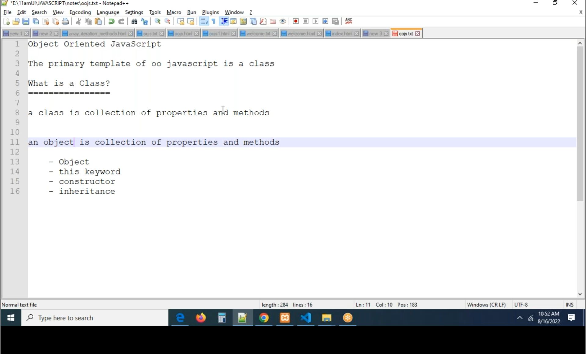
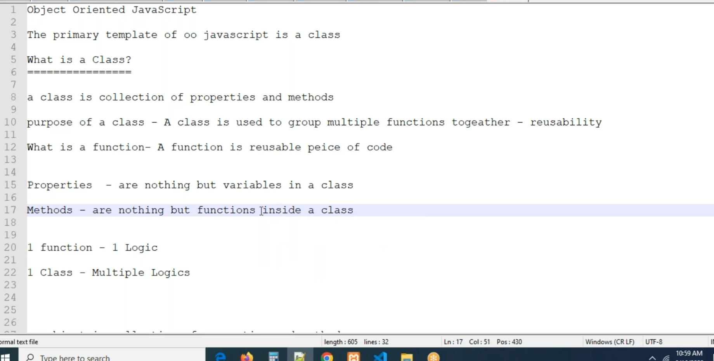
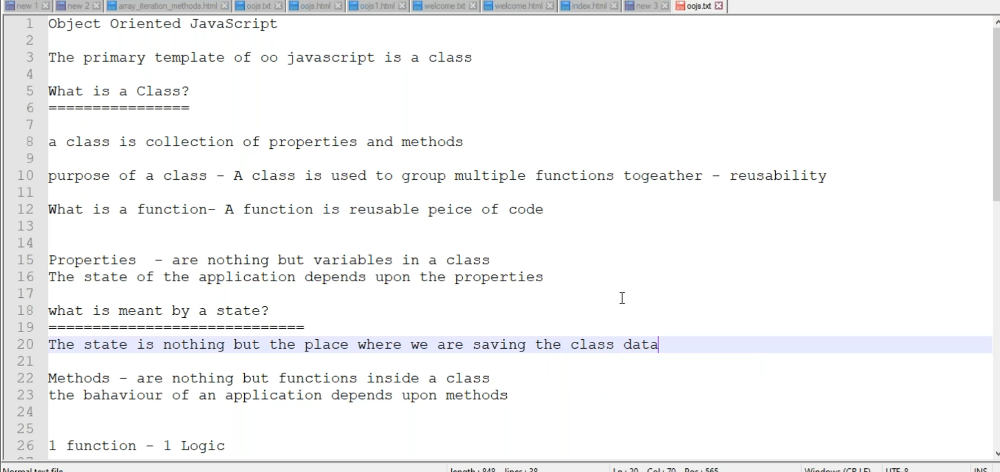
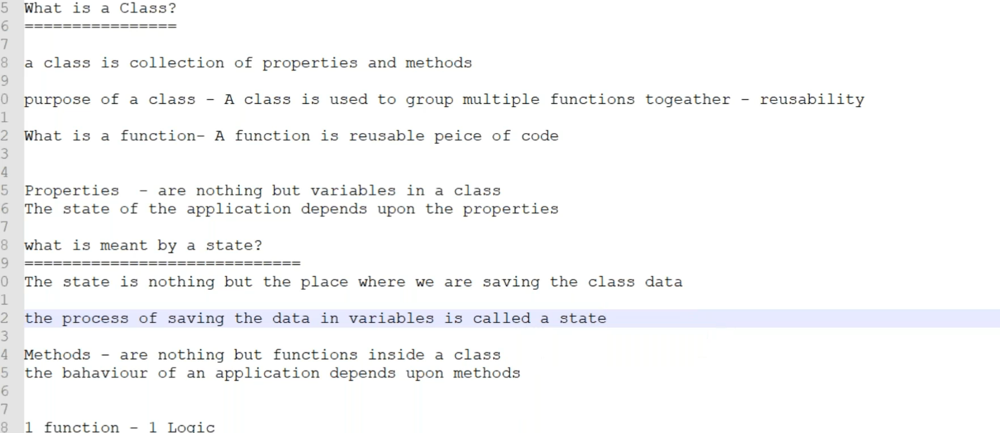
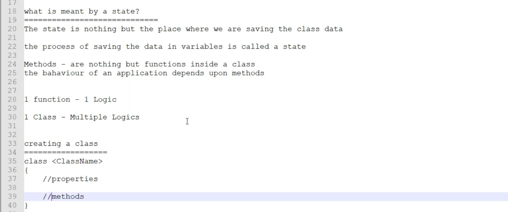
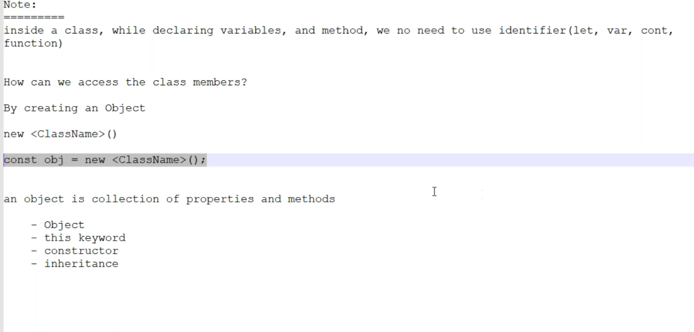
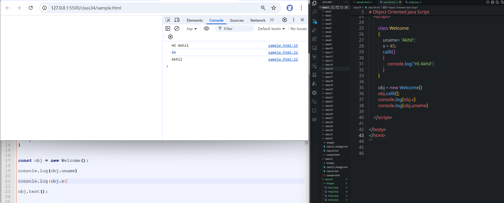

# class 34
# Class and Objects
# Object Oriented Java Script
  * **class**    
  * **Object**    
  * **this keyword**    
  * **constructor**    
  * **inheritence**    
* **promises, async, await**






```html
<!DOCTYPE html>
<html lang="en">
<head>
    <title>Document</title>
</head>
<body>
    <script>

        class Welcome
        {
            uname= 'Akhil';
            x = 45;
            callli()
            {
                return 'Hi Akhil';
            }
        }

        obj = new Welcome();
        console.log(obj.callli())
        console.log(obj.x)
        console.log(obj.uname)

    </script>
    
</body>
</html>
```



