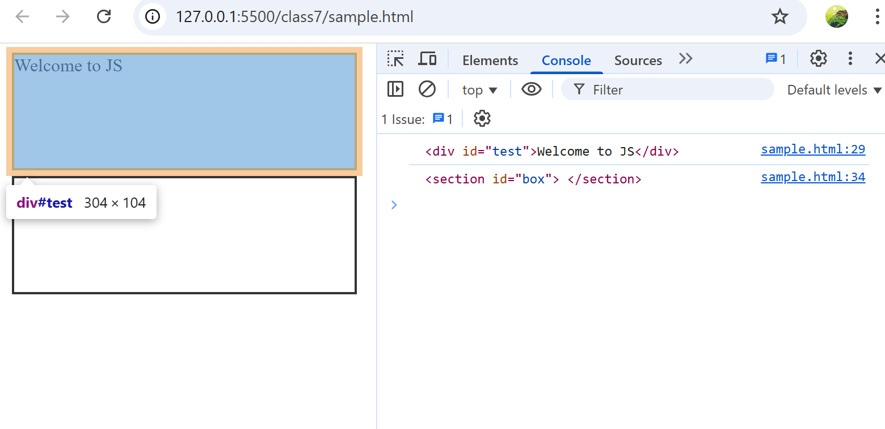
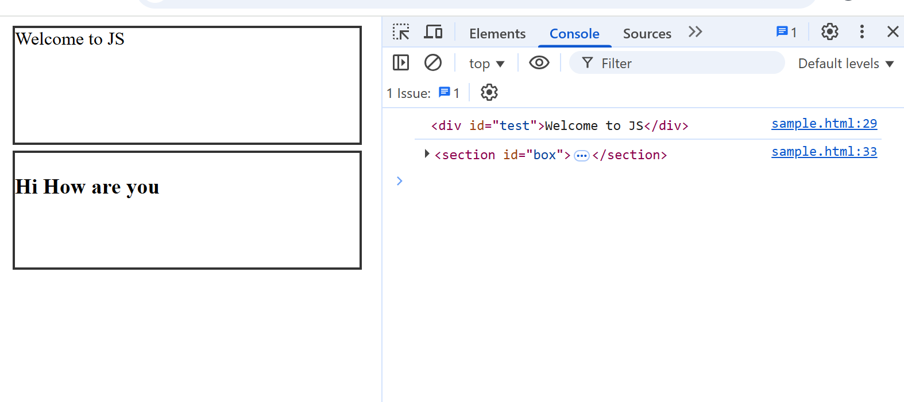
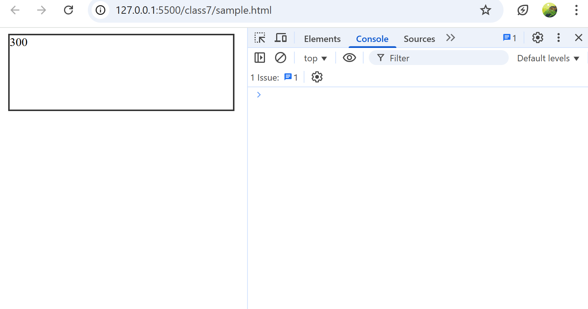
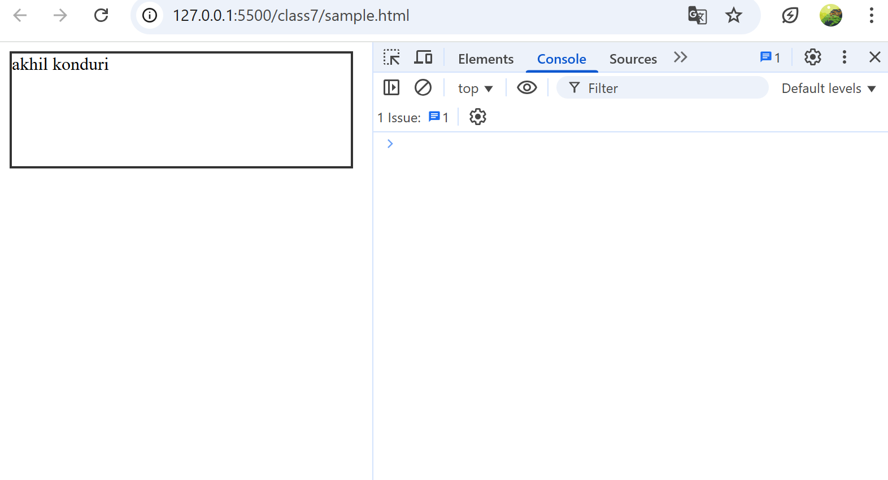
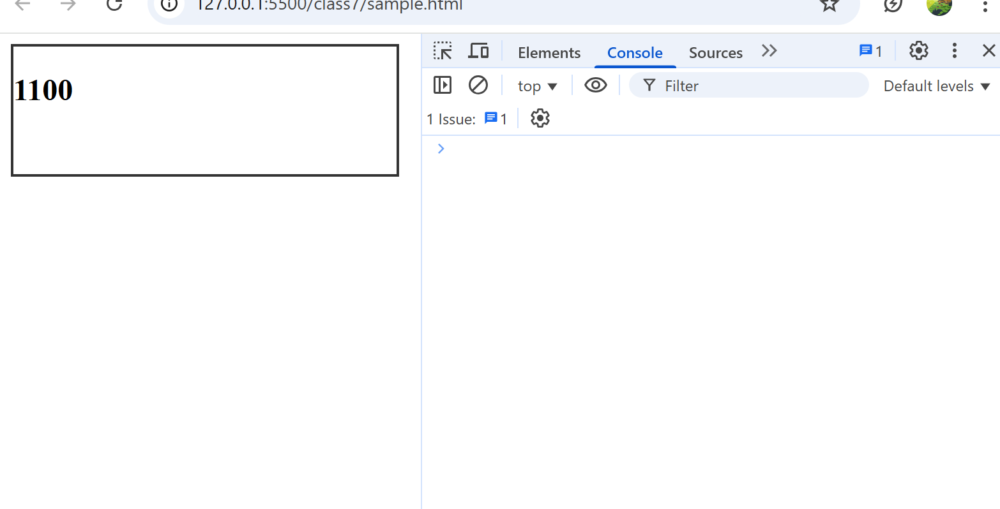
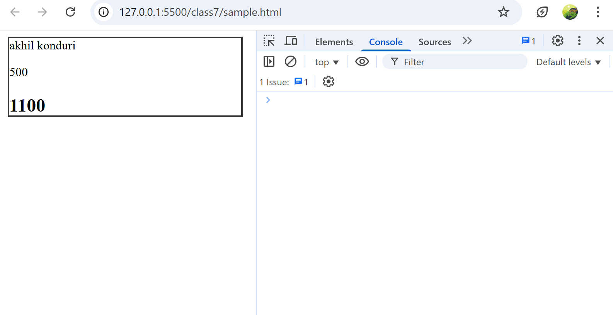
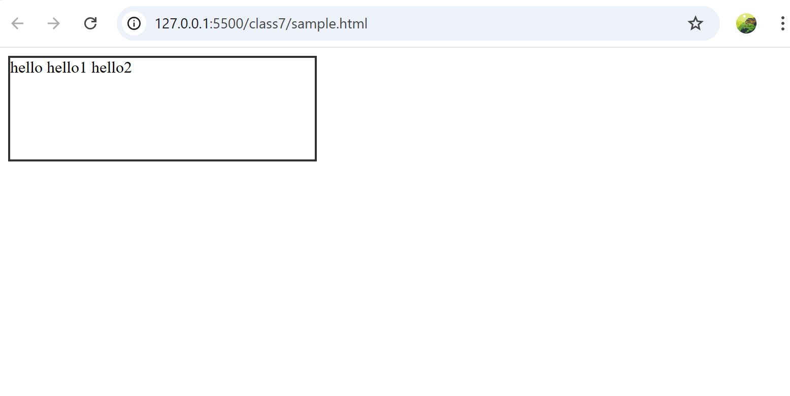
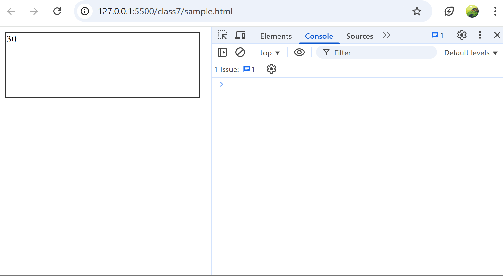

# Class7
## How to access element by id.
* we can access elements by using `document.getElementById();`.
      * In this method it can access id of the element
      * 
      * with id of the element we can access the elements
      * 
```html

<!-- Starting of HTML-->

<html>
    <head>
        <title>Tab of JS</title>
        <style>
            #test, #box{
                border: 2px solid #333;
                width: 300px;
                height: 100px;
                margin: 5px;
            }
        </style>
    </head>
    <body>

        <div id = 'test'>
        </div>

        <section id = 'box'>
        </section>

        <script>
            var title = 'Welcome to JS';

            var ele = document.getElementById('test');
            console.log(ele);
            ele.innerHTML = title;//we can pass variable value to the element

             var elee = document.getElementById('box');
            console.log(elee);
            elee.innerHTML = '<h3>'+'Hi How are you'+'</h3';// we can insert  value to the element 
            

        </script>

    </body>
</html>
```
```html

<!-- Starting of HTML-->

<html>
    <head>
        <title>Tab of JS</title>
        <style>
            #test, #box{
                border: 2px solid #333;
                width: 300px;
                height: 100px;
                margin: 5px;
            }
        </style>
    </head>
    <body>

        <div id = 'test'>
        </div>

        <section id = 'box'>
        </section>

        <script>
            var title = 'Welcome to JS';

/*             var ele = document.getElementById('test');
            console.log(ele);
            ele.innerHTML = title;//we can pass variable value to the element */
            document.getElementById('test').innerHTML = title;
/* 
            var elee = document.getElementById('box');
            console.log(elee);
            elee.innerHTML = '<h3>'+'Hi How are you'+'</h3';// we can insert  value to the element */
                document.getElementById('box').innerHTML = 'How are you';

        </script>

    </body>
</html>
```
* In realtime inside a funciton always `return` not `document.write()`
* 
* 
```html

<!-- Starting of HTML-->

<html>
    <head>
        <title>Tab of JS</title>
        <style>
            #test{
                border: 2px solid #333;
                width: 300px;
                height: 100px;
                margin: 5px;
            }
        </style>
    </head>
    <body>

        <div id = 'test'>
        </div>

        <script>
            
            var divEle = document.getElementById('test');

            function add(x, y){
                let  z = x + y;
                return z;
            }
                    /*             divEle.innerHTML=add(100, 200);
                    */
            document.getElementById('test').innerHTML = add('akhil ', 'konduri')
        </script>

    </body>
</html>
```
* 
* 
```html
  
<!-- Starting of HTML-->

<html>
    <head>
        <title>Tab of JS</title>
        <style>
            #test{
                border: 2px solid #333;
                width: 300px;
                height: 100px;
                margin: 5px;
            }
        </style>
    </head>
    <body>

        <div id = 'test'>
        </div>

        <script>
            
            var divEle = document.getElementById('test');

            function add(x, y){
                let  z = x + y;
                return z;
            }
/*             divEle.innerHTML=add(100, 200);
 */
/*             document.getElementById('test').innerHTML = add('akhil ', 'konduri');
            document.getElementById('test').innerHTML =' <p>'+add(200,300)+'</p>';
            document.getElementById('test').innerHTML =' <h2>'+add(200,900)+'</h2>'; */

            
            document.getElementById('test').innerHTML = add('akhil ', 'konduri');
            document.getElementById('test').innerHTML +=' <p>'+add(200,300)+'</p>';
            document.getElementById('test').innerHTML +=' <h2>'+add(200,900)+'</h2>';

        </script>

    </body>
</html>
```
##  we can create functions in  3 ways
### 1regular function
```sh
function welcome()
{
    return;
}
```
### 2 Function Expression
```sh
const welcome = function()
{
    return;
}
```
### 3 Fat Arrow Functions
* In real time scenario we use this mostly
```sh
const Welcome = () =>{
    return;
}
```
```html

<!-- Starting of HTML-->

<html>
    <head>
        <title>Tab of JS</title>
        <style>
            #test{
                border: 2px solid #333;
                width: 300px;
                height: 100px;
                margin: 5px;
            }
        </style>
    </head>
    <body>

        <div id = 'test'>
        </div>

        <script>
            
            var divEle = document.getElementById('test');

            function welcome(){
                return 'hello '
            }

            const welcomeOne = function(){
                return 'hello1 '
            }

            const welcomeTwo = () => {
                return 'hello2'
            }//in real time we use mostly this approach
            
            divEle.innerHTML += welcome();
            divEle.innerHTML += welcomeOne();
            divEle.innerHTML += welcomeTwo();

        </script>

    </body>
</html>

```


```html

<!-- Starting of HTML-->

<html>
    <head>
        <title>Tab of JS</title>
        <style>
            #test{
                border: 2px solid #333;
                width: 300px;
                height: 100px;
                margin: 5px;
            }
        </style>
    </head>
    <body>

        <div id = 'test'>
        </div>

        <script>
            
            var divEle = document.getElementById('test');


/*             const greeting = (name) =>{
                return 'Welcome to '+ name;
            }
            console.log(greeting('ram'));
            console.log(greeting('akhil')); */

/*             const add = (a, b) => {
                return a+b;
            };
 */

            const add = (a, b) => a + b;//if  you have one line in functioin {} are not mustly required
            const sub = (a, b) => a-b;

            let x = add(10, 20);
            document.getElementById('test').innerHTML = x;
            document.getElementById('test').innerHTML += sub(45, 7);


        </script>

    </body>
</html>

```



