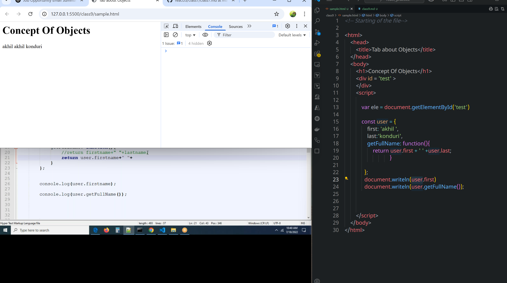
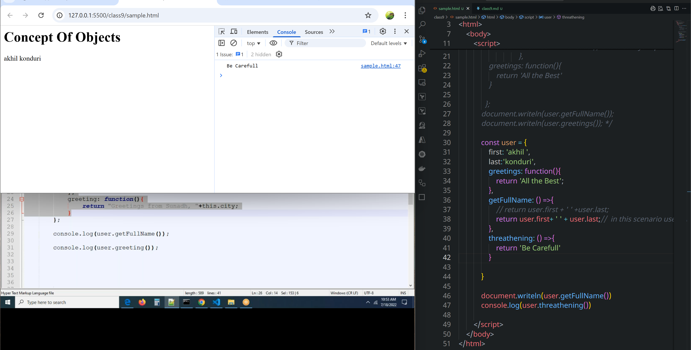
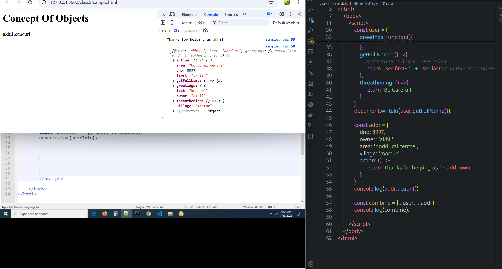
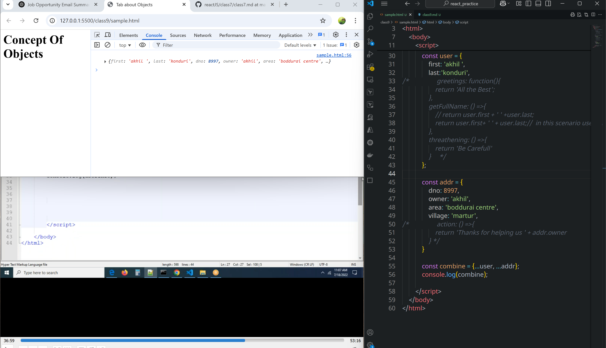
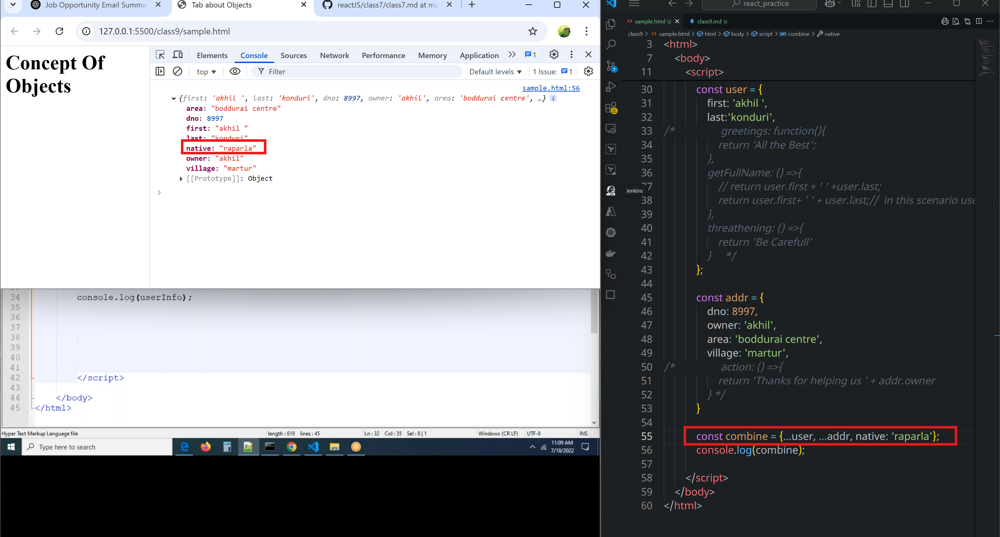
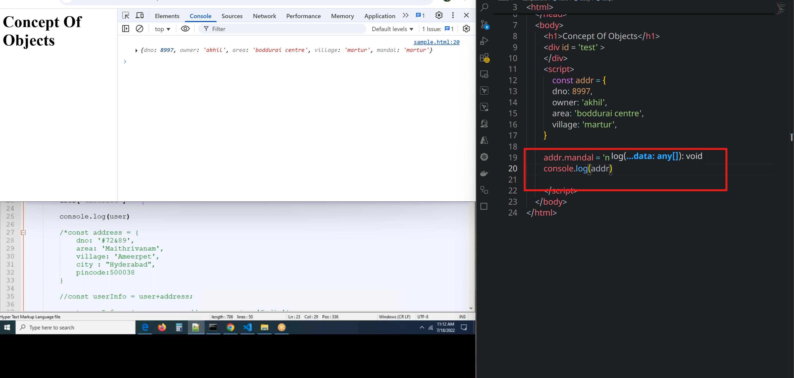
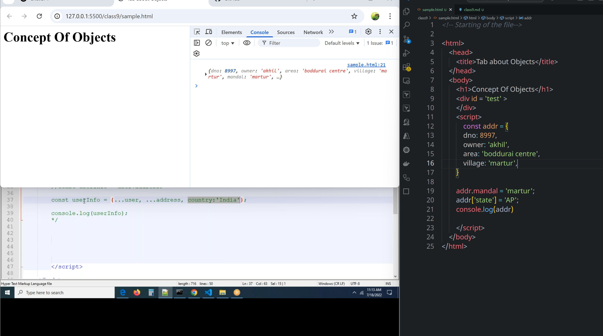
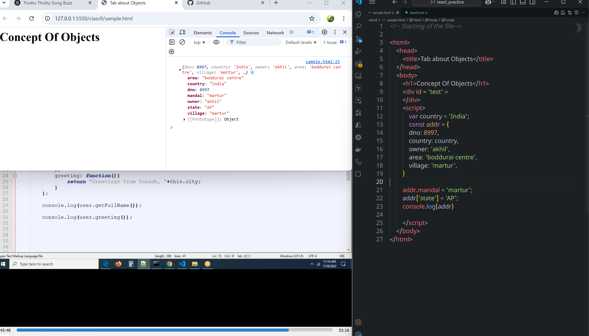
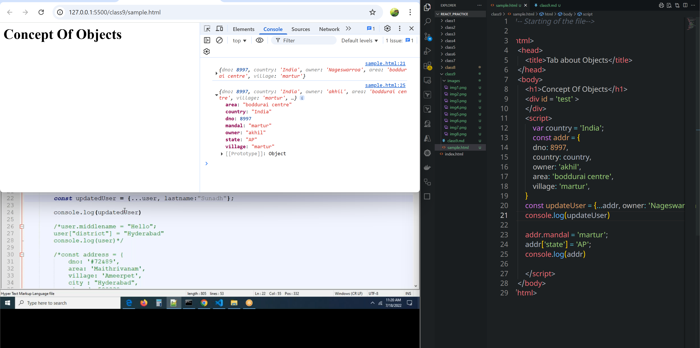

# Class 9
## Objects

* `this` is always represents current object

### Regular function or function expression
```html
<!-- Starting of the file-->

<html>
    <head>
        <title>Tab about Objects</title>
    </head>
    <body>
        <h1>Concept Of Objects</h1>
        <div id = 'test' >
        </div>
        <script>
            
            var ele = document.getElementById('test')

            const user = {
                first: 'akhil ',
                last:'konduri',
                getFullName: function(){
                    // return user.first + ' ' +user.last;
                    return this.first+ ' ' + this.last// this is always represents current object
                                },
                greetings: function(){
                    return 'All the Best'
                }
              
              };
            document.writeln(user.getFullName());
            document.writeln(user.greetings())


        </script>
    </body>
</html>
```

### Arroy function
```html
<!-- Starting of the file-->

<html>
    <head>
        <title>Tab about Objects</title>
    </head>
    <body>
        <h1>Concept Of Objects</h1>
        <div id = 'test' >
        </div>
        <script>
            
            var ele = document.getElementById('test')

/*             const user = {
                first: 'akhil ',
                last:'konduri',
                getFullName: function(){
                    // return user.first + ' ' +user.last;
                    return this.first+ ' ' + this.last// this is always represents current object
                                },
                greetings: function(){
                    return 'All the Best'
                }
              
              };
            document.writeln(user.getFullName());
            document.writeln(user.greetings()); */

/*             const user = {
                first: 'akhil ',
                last:'konduri',
                greetings: function(){
                    return 'All the Best'
                },
                getFullName: () =>{
                    // return user.first + ' ' +user.last;
                    return user.first+ ' ' + user.last;//  in this scenario user will work not this
                },
                
            };
            document.writeln(user.getFullName()) */

             const addr = {
                dno: 8997,
                owner: 'akhil',
                area: 'boddurai centre',
                village: 'martur',
                action: () =>{
                    return 'Thanks for helping us ' + addr.owner
                }
            }
            console.log(addr.action())


        </script>
    </body>
</html>
```


### merging two objects into single object by using Spread operator
* This can be done by using operator called Rest Operator or Spread Operator`...`
* By using this we can merge objects.



```html
<!-- Starting of the file-->

<html>
    <head>
        <title>Tab about Objects</title>
    </head>
    <body>
        <h1>Concept Of Objects</h1>
        <div id = 'test' >
        </div>
        <script>
            
            var ele = document.getElementById('test')

/*             const user = {
                first: 'akhil ',
                last:'konduri',
                getFullName: function(){
                    // return user.first + ' ' +user.last;
                    return this.first+ ' ' + this.last// this is always represents current object
                                },
                greetings: function(){
                    return 'All the Best'
                }
              
              };
            document.writeln(user.getFullName());
            document.writeln(user.greetings()); */

            const user = {
                first: 'akhil ',
                last:'konduri',
   /*              greetings: function(){
                    return 'All the Best';
                },
                getFullName: () =>{
                    // return user.first + ' ' +user.last;
                    return user.first+ ' ' + user.last;//  in this scenario user will work not this
                },
                threathening: () =>{
                    return 'Be Carefull'
                }    */             
            };
            document.writeln(user.getFullName());

            const addr = {
                dno: 8997,
                owner: 'akhil',
                area: 'boddurai centre',
                village: 'martur',
/*                 action: () =>{
                    return 'Thanks for helping us ' + addr.owner
                } */
            }
            console.log(addr.action());

            const combine = {...user, ...addr, native: 'Martur'};
            console.log(combine);

        </script>
    </body>
</html>
```
### Adding key-values 


```html
<!-- Starting of the file-->

<html>
    <head>
        <title>Tab about Objects</title>
    </head>
    <body>
        <h1>Concept Of Objects</h1>
        <div id = 'test' >
        </div>
        <script>
            const addr = {
            dno: 8997,
            owner: 'akhil',
            area: 'boddurai centre',
            village: 'martur',
        }

        addr.mandal = 'martur';
        addr['state'] = 'AP';
        console.log(addr);
 
        </script>
    </body>
</html>
```



